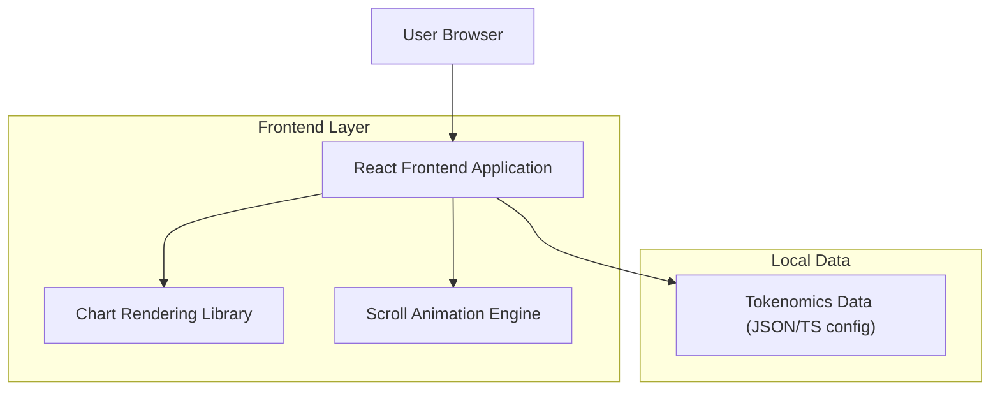

## 1.Architecture design

## 2.Technology Description
- Frontend: React@18 + vite + TypeScript
- UI/Styling: tailwindcss@3 (sau CSS Modules, în funcție de proiect)
- Chart: Recharts (sau ECharts) pentru pie/donut + tooltip + legend toggles
- Scroll animations: framer-motion (useScroll/useInView/useTransform) pentru animații declanșate la scroll
- Backend: None (datele Tokenomics sunt servite ca asset/config)

## 3.Route definitions
| Route | Purpose |
|-------|---------|
| / | Home page, include CTA către Tokenomics |
| /tokenomics | Pagină Tokenomics cu chart interactiv și secțiuni animate la scroll |

## 6.Data model(if applicable)
### 6.1 Data model definition
Datele sunt statice (config) și pot fi definite ca tipuri TypeScript:
- TokenomicsCategory: id, label, percent, amount (optional), description, vesting (optional)
- VestingMilestone: date, unlockedPercent/amount, note

### 6.2 Data Definition Language
Nu se folosește bază de date pentru