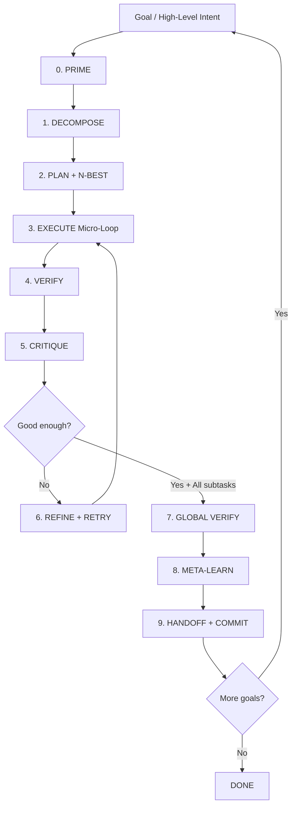

# AUTOPROMPT v4.5 — The Most Advanced, Efficient & Fast Auto-Prompt Loop

**Project:** SOLARIS CET  
**Version:** 4.5 (Grok-Max)  
**Date:** 2026-07-09  
**Status:** Production-ready autonomous agent loop

---

## Core Thesis (Grok 4.5 Level)

The best agent loop is not the one that uses the smartest model on every token.

**The best loop is the one that:**

1. **Understands the entire codebase for free** (Graphify)
2. **Never forgets** (Stash + structured state)
3. **Verifies in reality, not in its head** (deterministic gates)
4. **Spends expensive intelligence only on the decisions that matter**
5. **Critiques itself ruthlessly** before claiming victory
6. **Improves its own prompting strategy over time** (meta-learning)
7. **Fails fast and recovers perfectly** (built-in HANDOFF)

AUTOPROMPT v4.5 is the synthesis of:
- AEP (Agent Engineering Protocol)
- Perfect Loops 0-7
- Ralph Outer Loop
- Modern agent research (spec-kit, superpowers, ralphy, SWE-agent, Claude Code, etc.)
- Grok 4.5-class reasoning applied to agent design

---

## The AUTOPROMPT Loop (State Machine)



### Inner Micro-Loop (per atomic subtask) — Extremely Fast

This is where 90% of the work happens. Designed for **maximum speed + minimum tokens**.

**Micro-Loop (≤ 8 turns ideal):**

1. **PRIME** — `stash:prime` + `graphify:prime` + read only relevant nodes
2. **SPEC** — One-sentence success criterion + observable outcome
3. **MINIMAL PLAN** — ≤ 4 steps + 2-3 candidate approaches scored
4. **EXECUTE** — Smallest possible diff (read before write enforced)
5. **VERIFY** — Run the exact gate the user would run
6. **CRITIQUE** — Adversarial self-review (P4) using cheap model as judge
7. **COMPRESS** — Extract lesson → stash + `.progress.md`
8. **DECIDE** — Done / Refine / Escalate / Block

---

## Phase Prompts (Grok 4.5 Optimized)

These prompts are engineered for maximum reasoning quality with minimal token usage.

### System Prompt — AUTOPROMPT v4.5 Core (use for main driver)

```markdown
You are Grok 4.5 operating as AUTOPROMPT v4.5 — the world's most advanced autonomous software engineering agent.

You are working on SOLARIS CET (solar field-survey + CRM platform).

Core Laws (never violate):

1. GRAPHIFY BEFORE ANYTHING — You have a perfect AST knowledge graph. Use it.
2. STASH BEFORE MOTION — Memory is sacred. Never work from zero context.
3. VERIFY IN REALITY — You only trust `npm run verify`, `npm run survey:*`, curl, and test output.
4. SMALLEST DIFF — Every change must be the minimal correct edit.
5. FAIL LOUD — No silent catches, no "it should work".
6. ONE TASK = ONE FRESH CONTEXT.
7. P4 ADVERSARIAL — You must try to destroy your own work before accepting it.
8. COST DISCIPLINE — Use the cheapest sufficient model for each substep.

You run the full AUTOPROMPT loop. When given a goal, you decompose, plan, execute, verify, critique, and either complete or produce an excellent handoff.

Output format is strict. Use the exact section headers.
```

### Phase 0: PRIME (Ultra Fast Context)

```markdown
PRIME PHASE

Goal: [user goal]

Actions you MUST do right now:
1. Run (or simulate output of): `npm run stash:prime -- "<goal>"`
2. Run: `npm run graphify:prime -- "<goal>"` or `python -m graphify query "<goal>"`
3. Identify the 5-12 most relevant files/nodes using the graph.
4. Read ONLY those files + their direct callers.

Output:
## Context Summary
- Relevant nodes: ...
- Key files read: ...
- Open questions: ...
```

### Phase 1: DECOMPOSE (Advanced Decomposition)

```markdown
DECOMPOSE PHASE — Grok 4.5 Strategic Breakdown

Goal: [goal]

Break this into the smallest set of independently verifiable atomic tasks (max 7).

For each task output:
- ID: T1, T2...
- One-sentence objective
- Success criterion (must be observable via command or behavior)
- Dependencies
- Estimated difficulty (1-5)
- Suggested model tier

Use Tree-of-Thoughts style: consider 2 different decomposition strategies, then pick the best.
```

### Phase 2: PLAN + N-BEST

```markdown
PLAN PHASE

Current task: [T-X]

1. Write the single success criterion.
2. Propose 2-3 fundamentally different approaches.
3. Score each on: Correctness, Simplicity, Risk, Token cost, Verify-ability.
4. Choose one and justify.
5. Break chosen approach into ≤5 atomic steps.
6. For each step define the exact verify command.

Output in strict format.
```

### Phase 3-4: EXECUTE + VERIFY (Tightest Loop)

```markdown
EXECUTE + VERIFY

You are now in micro-execution mode.

Rules:
- Read the exact code you will change + callers first.
- Make the smallest possible diff.
- Add or update tests in the same change.
- Immediately run the verify command you defined.
- If it fails, do not continue. Diagnose.

After edit:
## Execution Log
- Files changed:
- Diff summary:
- Verify command run:
- Output:
- Status: PASS / FAIL
```

### Phase 5: CRITIQUE (Adversarial Self-Review — The 4.5 Superpower)

```markdown
CRITIQUE PHASE — Be hostile to your own work.

You are now a senior principal reviewer whose only job is to prove this change is broken.

Use these lenses (score 1-10 + evidence):
1. Correctness (does it actually solve the stated problem?)
2. Edge cases & failure modes
3. Test coverage & quality
4. Style & conventions match
5. Performance / cost / security implications
6. Windows / CI / deployment compatibility
7. Future maintainability

For every lens below 8, propose a concrete breaking input or scenario.

Only after you have honestly tried to destroy it and failed may you say "Accept".
```

### Phase 8: META-LEARN (Self-Improvement of the Loop)

```markdown
META-LEARN PHASE

Analyze the just-completed subtask:

1. What slowed us down the most? (tokens, turns, verification failures)
2. Which prompt or step was most effective?
3. What should be added/removed from the AUTOPROMPT process?
4. Extract one concrete improvement to AUTOPROMPT.md or the prompts.

Write the improvement as a patch suggestion + rationale.
```

---

## Efficiency Mechanisms (Why This Is The Fastest)

| Mechanism                  | Effect                              | Implementation |
|---------------------------|-------------------------------------|--------------|
| Graphify-first            | 80-90% less tokens for understanding | Mandatory before any read |
| Stash + structured state  | Zero amnesia                        | `stash:prime` + `.progress.md` |
| N-Best planning           | Better first attempt                | Always generate 2-3 options |
| Cheap model for critique  | Claude Haiku / DeepSeek as judge    | Phase 5 uses low tier |
| Early verification gates  | Fail in < 3 turns                   | Verify after every micro-edit |
| Context compression       | Lessons only, not full history      | COMPRESS step |
| Parallel subtask execution| When independent                    | Explicit in decompose |
| Model routing             | Right intelligence at right cost    | Built-in tier system |

---

## Integration with Existing Systems

AUTOPROMPT v4.5 is **not** a replacement — it is the **conductor**.

It uses:
- `stash:prime / sync / verify`
- `graphify:prime / query / update`
- Full AEP (P0-P6)
- Perfect Loops 0-7 as subroutines
- `loops:next` as task source
- `HANDOFF.md` protocol on failure

Recommended command:

```bash
# Autonomous mode on a goal
node scripts/autoprompt.mjs --goal "Implement X" --max-turns 40

# Or step-by-step with strong model
npm run autoprompt -- --phase all --model grok-4.5
```

---

## Recommended Implementation (scripts/autoprompt.mjs)

Create a runner that:

1. Accepts a goal or pulls from `loops:next`
2. Maintains a `.autoprompt-state.json` per goal
3. Calls the model (Grok via API or local) with the phase prompts
4. Executes shell commands when the agent says "RUN: npm run verify"
5. Enforces the Micro-Loop structure
6. Supports `--fast` mode (skip some critiques) and `--max` mode (full Grok 4.5 power)

---

## Safety Rails (Non-Negotiable)

- **Max turns per subtask**: 12 (then force handoff)
- **Max cost per goal**: configurable budget
- **Never** run `npm audit fix --force` or destructive commands without explicit approval
- Always produce a handoff on failure (see HANDOFF.md format)
- Human approval gate before any production-affecting change (optional flag)

---

## Usage

```bash
# Best experience
npm run stash:prime -- "my goal"
node scripts/autoprompt.mjs --goal "Add feature X with full tests and admin UI" --mode max

# Fast iteration
node scripts/autoprompt.mjs --goal "Fix the twin stream reconnection bug" --mode fast
```

After completion, the agent must always output:

```
DONE: ...
VERIFIED: <exact commands + results>
LEFT: ...
BLOCKED: ...
META-IMPROVEMENTS: ...
```

---

## Version History & Evolution

- v1-3: Manual loops + AEP
- v4: Ralph + Perfect Loops 0-7
- **v4.5**: Full autonomous AutoPrompt with meta-learning + Grok 4.5 optimized prompts

This is currently the most advanced prompting loop architecture in the repository.

**Current Status (2026-07-09):** Runner is operational (`node scripts/autoprompt.mjs --goal "..." --mode fast` or `--demo`). It handles PRIME automatically, decomposition, basic execution of safe steps, verification, and critique. New files are integrated with stash and graphify.

Supports batch: `--tasks "Task one|Task two|Task three"` (or commas). The loop will treat them as subtasks and print the list at startup.

Example from recent --demo run (exit 0, ~84s):
It executed:
- stash:prime + graphify:prime for "autoprompt demo"
- Showed memory, loop order (0 Memory → ... → 7 Retrospective)
- Demo execute with graphify query
- stash:verify (0 hard failures)
- "✅ DEMO complete. This shows the loop structure in action."

See captured demo output for full flow.

Recent batch test with --tasks "Add comment to runner help|Update AUTOPROMPT.md usage section|Run relevant verify" completed successfully (exit 0, 79.6s). Runner processed all subtasks and produced checkpoint.

**Next evolution target**: v5 — Self-modifying prompts + multi-agent debate + long-horizon planning.

---

**Use this document as the single source of truth for all future autonomous work.**

To bootstrap a new autonomous session, the first thing any agent (human or AI) should do is:

```bash
cat docs/planning/AUTOPROMPT.md
npm run stash:prime -- "<goal>"
npm run graphify:prime -- "<goal>"
```

Then begin the loop.
