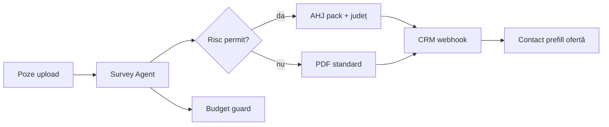

# SOLARIS CET — Soluții din consultanță S&P 500 (white papers gratuite)

**Data:** 2026-07-06  
**Scop:** Transformă insight-urile din rapoarte gratuite McKinsey/BCG/Accenture/DOE/NREL în **produse și loop-uri** pentru SOLARIS CET — AI survey fotovoltaic, raport permit-ready, CRM instalatori.

> Consultanții vând rapoarte de $5k–$500k către Fortune 500. Noi extragem **framework-urile gratuite** și le implementăm în cod + procese.

---

## 1. Piața disruptată — de ce ideea ta câștigă acum

### Date hard (nu opinii)

| Sursă | Insight | Implicație SOLARIS |
|---|---|---|
| [SEIA / Wood Mackenzie via Aurora](https://aurorasolar.com/blog/what-are-solar-soft-costs-a-solar-industry-overview/) | **Soft costs = până la 65%** din costul unui sistem rezidențial PV în SUA | Nu vinzi panouri — vinzi **reducere soft costs** |
| [DOE SETO](https://www.energy.gov/cmei/systems/soft-costs) | Soft costs trebuie să scadă **60–70%** suplimentar; include design, siting, **permitting**, instalare, interconectare | Survey + PDF = pârghie directă pe design/permit/inspection |
| [NREL via Aurora](https://aurorasolar.com/nrel-shading.pdf) | Design remote economisește **~$0.17/W** (~$850 la 5 kW) | Poze șantier + AI ≈ remote survey — același ROI narrative |
| [MIT via Aurora](https://news.mit.edu/2023/improving-solar-looking-beyond-hardware-0817) | Soft cost innovations **nu se exportă** între țări — Germania ~50% mai ieftin la soft | **România = greenfield** — SOLARIS poate fi standardul local |
| [SolarAPP+ / DOE](https://solarapp.nrel.gov/) | Permitting adaugă ~**$1/W** (~$6–7k residential) | Export **permit-ready** = killer feature |
| [BCG Field Service 2025](https://www.bcg.com/publications/2025/the-next-frontier-of-field-service) | AI field service: **+10–15% productivitate**, **-15–20% durată job**, renewable operator case | Validare directă pentru `/survey` pe șantier |
| [BCG Energy 2024](https://www.bcg.com/publications/2024/ai-adoption-in-energy) | Avantajul nu e algoritmul — e **agilitatea** (people/process 70%) | Loop-uri + change management > model nou |
| [BCG GenAI 2024](https://www.bcg.com/publications/2024/gen-ai-increases-productivity-and-expands-capabilities) | GenAI extinde aptitudini **dacă** există supervizor cu „engineering mindset” | Tehnician + AI + review Fable 5 = model corect |
| [Sogeti Agentic AI](https://labs.sogeti.com/harnessing-the-ooda-loop-for-agentic-ai-from-generative-foundations-to-proactive-intelligence/) | **OODA** + Intent → Interpretation → Execution | Fundament loop-uri v4 |
| [Sogeti Whitepaper 2026](https://labs.sogeti.com/whitepaper-transforming-enterprise-software-delivery-through-agentic-ai/) | Agentic SE: spec-driven, oameni rămân accountable pentru intent | `tasks.md` + Grok orchestrator |

### Poziționare SOLARIS CET (elevator pentru S&P 500 / instalatori)

**„Soft-cost compression platform for field solar survey”** — reduce timpul de documentare 45–90 min → <20 min, generează pachet permit-ready, alimentează CRM și ofertă.

Competitori indirecti: [Aurora Solar](https://aurorasolar.com) (design remote, sales), SiteCapture (documentare). **Diferențiator:** focus **șantier real** (poze, GPS, offline PWA, AHJ RO, multi-model cost-aware, Gitea self-host).

---

## 2. Șase soluții produse (din BCG Field Service → SOLARIS)

BCG identifică [6 factori de succes](https://www.bcg.com/publications/2025/the-next-frontier-of-field-service) pentru field AI. Mapare 1:1:

### S1 — Unified Data Layer (strat de date unificat)

**Ce vând consultanții:** semantic data layer peste IoT, work orders, manuale, CRM.  
**Ce construim:**

| Entitate | Sursă | Locație |
|---|---|---|
| Survey report | `survey-engine` | `ReportMetadata`, dashboard |
| Jurisdicție RO | `jurisdictions.py` | `/jurisdictions` |
| Lead CRM | Node API | `/api/survey/crm` |
| Cost per model | health/stats | `SURVEY_COST_BUDGET_USD` |
| Installer profile | UI localStorage | `SurveyPage.tsx` |

**Deliverable:** `GET /api/survey/context/{report_id}` — un JSON pentru agenți CRM, PDF, webhook.

**VERIFY:** pytest context endpoint + Vitest route.

---

### S2 — Edge Experience (experiență șantier)

**Ce vând consultanții:** multimodal offline, voice, image recognition, mâini libere.  
**Ce construim (deja parțial):**

- PWA offline ✅ → extinde: **voice checklist** (Web Speech API)
- Photo → AI ✅ → extinde: **overlay defect** pe thumbnail
- **One-thumb UI** — butoane mari, contrast soare

**KPI BCG:** +20–30% eficiență tehnician nou.  
**VERIFY:** E2E offline draft + sync.

---

### S3 — Adaptive Field Loop (învață din teren)

**Ce vând consultanții:** tehnicianul corectează AI → modelul se îmbunătățește.  
**Ce construim:**

```
Tehnician marchează „AI greșit” pe checklist item
  → salvează în `corrections.jsonl` (anonimizat)
  → Loop săptămânal: Grok review → prompt patch
  → pytest golden set actualizat
```

**VERIFY:** correction event + prompt version bump în `global.md`.

---

### S4 — Explainable AHJ (AI de încredere)

**Ce vând consultanții:** explainability → adoptare +30% forecast accuracy (airline MRO case).  
**Ce construim:**

- Fiecare finding vision: `{ claim, confidence, evidence_photo_ids, reasoning_short }`
- PDF secțiune **„Basis of opinion”** — Fable 5 doar pe text, nu pe poze
- Admin: flag dacă confidence < 0.7

**Model:** DeepSeek/Kimi extrag + **Claude Fable 5** scrie narrativa premium cu referințe la JSON.

**VERIFY:** pytest structure + sample PDF manual.

---

### S5 — Agentic Service Orchestration (agent șantier)

**Ce vând consultanții:** agentul primește semnal → diagnostic → procedură → piese → tehnician.  
**Ce construim pentru SOLARIS:**



**Agent roles:** Grok plan · DeepSeek vision · Kimi 10+ poze · Sonnet/Fable text · Node executor.

**Guardrails BCG:** acțiuni reversibile, limite cost (`rate_limit`, budget health).

**VERIFY:** E2E survey → CRM → contact.

---

### S6 — Modular API-First (viitor 3D / twin)

**Ce vând consultanții:** API-first, containere, GenAI plug-in fără replatform.  
**Ce construim:** deja monorepo — documentează **OpenAPI bridge** `/api/survey/*` ca contract stabil pentru viitor Digital Twin (D10).

---

## 3. Framework BCG „Deploy → Reshape → Invent”

| Fază | Horizon | SOLARIS CET |
|---|---|---|
| **Deploy** | 0–12 luni | `/survey` + PDF + CRM + `dev:local` + smoke — **ești aici** |
| **Reshape** | 12–24 luni | S1–S4: context API, explainable AHJ, adaptive corrections, permit export |
| **Invent** | 24–36 luni | Agentic orchestration completă, installer SaaS API keys, batch multi-șantier scale, digital twin feed |

**Regulă 10/20/70 (BCG):** 70% efort pe people/process — de aceea **loop-uri + training tehnician** contează la fel ca codul.

---

## 4. Loops v4 — furate din white papers (peste v3)

### L-BCG-DRS — Deploy-Reshape-Invent Loop

```
1. Classify task: Deploy | Reshape | Invent
2. Deploy → verify:fast only
3. Reshape → + E2E + doc global.md
4. Invent → + design.md + stakeholder checkpoint
```

### L-FS-6 — Field Service 6-Factor Loop (per feature șantier)

Ordine obligatorie:
1. Data layer touch?
2. Edge UX (offline/voice)?
3. Adaptive feedback hook?
4. Explainability in output?
5. Agent orchestration safe?
6. API modular boundary?

### L-OODA-ITE — Sogeti Agentic Loop

| OODA | Sogeti | SOLARIS command |
|---|---|---|
| Observe | Intent | `stash:prime` + poze/GPS input |
| Orient | Interpretation | Research + `global.md` routing |
| Decide | Interpretation | Grok plan + Fable gate |
| Act | Execution | Build + `survey:smoke` |
| (feedback) | Learning | Retro + `corrections.jsonl` |

### L-SUP-GATE — BCG Henderson Supervision Gate

Înainte de Fable 5 sau deploy prod:

```
IF task outside model capability OR confidence < threshold:
  → escalate to expert review checkpoint (human or Grok)
  → NEVER ship on AI-only for permit/AHJ
```

### L-SOFT-ROI — Soft Cost Value Loop (end of every release)

```
MEASURE: minutes_saved × installer_hourly_rate
COMPARE: NREL $0.17/W benchmark narrative
LOG: in admin analytics + grok.md
VERIFY: dashboard shows ROI per installer_id
```

### L-AGILITY-70 — BCG People/Process Loop

La fiecare epic:
- 10% algorithms (model routing tweak)
- 20% data (jurisdictions, prompts)
- **70% adoption** (UI tehnician, training snippet, retrospective)

---

## 5. Roadmap produse (prioritate)

| P | Soluție | Efort | Impact soft cost |
|---|---|:---:|---|
| P0 | Permit-ready PDF + județe RO | S | Permitting |
| P0 | Soft Cost ROI widget admin | S | Sales story |
| P1 | `/context/{report_id}` unified API | M | BCG data layer |
| P1 | Explainable findings JSON | M | Trust / AHJ |
| P2 | Technician correction flywheel | M | Adaptive AI |
| P2 | SolarAPP-style export JSON | L | Permitting US expansion |
| P3 | Voice checklist edge | M | Field UX |
| P3 | Agentic full orchestration | L | BCG invent |

**Primul epic task file:** `docs/planning/features/soft-cost-platform/tasks.md`

---

## 6. Surse gratuite de monitorizat (newsletter / PDF)

| Firmă | Resursă gratuită | URL |
|---|---|---|
| BCG | Field Service AI series | [bcg.com/.../field-service](https://www.bcg.com/publications/2025/the-next-frontier-of-field-service) |
| BCG | AI in Energy playbook | [bcg.com/.../ai-adoption-in-energy](https://www.bcg.com/publications/2024/ai-adoption-in-energy) |
| BCG Henderson | GenAI augmented worker | [bcg.com/.../gen-ai-increases-productivity](https://www.bcg.com/publications/2024/gen-ai-increases-productivity-and-expands-capabilities) |
| Sogeti/Capgemini | Agentic AI + OODA | [labs.sogeti.com](https://labs.sogeti.com/research/) |
| Accenture | Tech Vision Utilities | [accenture.com/.../utilities](https://www.accenture.com/us-en/blogs/utilities/tech-vision-2025-utilities-industry-perspective) |
| DOE | Soft costs + SolarAPP+ | [energy.gov/cmei/systems/soft-costs](https://www.energy.gov/cmei/systems/soft-costs) |
| NREL | SolarAPP, benchmarks | [nrel.gov/solar](https://www.nrel.gov/solar) |
| IRENA | Digitalisation + AI power | [irena.org publications](https://www.irena.org/Publications) |
| Gartner | Top 12 disruptions | [gartner.com newsroom 2025](https://www.gartner.com/en/newsroom/press-releases/2025-04-07-gartner-identifies-top-12-early-stage-technology-disruptions-that-will-define-the-future-of-business-systems) |
| McKinsey | Global Energy Perspective | [mckinsey.com/.../global-energy-perspective](https://www.mckinsey.com/industries/energy-and-materials/our-insights/global-energy-perspective) |

---

## 7. Comenzi loop v4

```bash
npm run stash:prime -- soft-cost permit
npm run loops:next -- soft-cost-platform
# Per task: L-FS-6 checklist + L-SUP-GATE before Fable 5
npm run survey:smoke && npm run stash:sync
```

Skill actualizat: `.claude/skills/solaris-perfect-loops/SKILL.md` (secțiunea Consulting Loops v4).