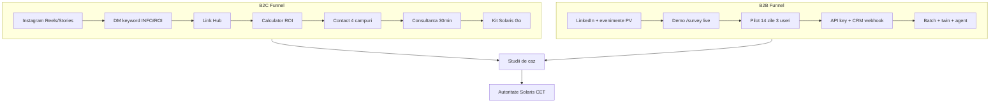

# SOLARIS CET — Go-To-Market Strategy (v3.3 FINAL)

**Date:** 2026-07-06  
**Method:** Rule of 3 × 3 — 3 passes, each improved 3× via Perfect Loops (Memory → Build → Verify → Retro)  
**Models:** Grok Heavy (orchestrator) · DeepSeek V4 Pro (research/code) · Sonnet 5/Fable 5 (premium pitch text)  
**Canonical product:** [solaris-cet.com](https://solaris-cet.com) · Survey SaaS `/survey` · B2C kits + calculator

---

## 0) Executive summary

SOLARIS CET operează **două motoare de venit** care se întăresc reciproc:

| Motor | Ce vindem | Cine cumpără | De ce acum |
|---|---|---|---|
| **B2C — Autonomie practică** | Kituri plug-and-play (Solaris Go), calculator ROI, consultanță | Proprietari case/cabane, zone izolate, early adopters energie | Zgomot de piață, confuzie brand „Solaris”, cerere de claritate + dovadă |
| **B2B — Soft-cost compression** | Survey AI șantier, PDF/AHJ permit-ready, CRM, twin feed, API | Instalatori PV 3–50 tehnicieni, EPC-uri, integratori | Soft costs = până la 65% din cost PV; România = standard nedefinit |

**Poziționare unificată:**  
> *„Solaris CET — partenerul care transformă energia solară din promisiune în autonomie măsurabilă: pentru proprietari (kit + ROI) și pentru instalatori (documentare șantier în <20 min, permit-ready).”*

**Obiectiv GTM 12 luni:** 40 instalatori plătitori B2B + 120 lead-uri B2C calificate/lună + NPS instalatori ≥ 45.

---

## 1) Metodologie — Rule of 3 × 3 Loops

### Pass 1 — Foundation (v1.0 → v1.3)

| Loop | Îmbunătățire | Output |
|---:|---|---|
| L1 | ICP + persona + pain map | §2 Personas |
| L2 | Value props + proof assets | §3 Messaging |
| L3 | Competitive + differentiation | §4 Competition |

### Pass 2 — Integration (v2.0 → v2.3)

| Loop | Îmbunătățire | Output |
|---:|---|---|
| L4 | Channel map B2C+B2B synergy | §5 Channels |
| L5 | Pricing, packaging, land-expand | §6 Pricing |
| L6 | Partner + installer motion | §7 Partners |

### Pass 3 — Execution (v3.0 → v3.3)

| Loop | Îmbunătățire | Output |
|---:|---|---|
| L7 | 90/180/365-day calendar | §8 Roadmap |
| L8 | Budget, team, tooling | §9 Ops |
| L9 | KPI dashboard + risks | §10–11 |

**Comenzi loops:** `npm run stash:prime -- go-to-market` · `npm run loops:refine` · `npm run loops:status` · `npm run stash:sync`

---

## 2) ICP & Personas (Pass 1 — L1)

### 2.1 B2C — „Autonomul practic”

| Atribut | Detaliu |
|---|---|
| **Demografic** | 35–60 ani, proprietar casă/cabană, venit mediu+, România |
| **Geografic** | Zone izolate, sate, margini urbane, zone cu întreruperi rețea |
| **Psihografic** | Vrea control costuri, sceptic față de „oferte solare” agresive |
| **Trigger** | Factură mare, pană curent, vecin cu panouri, Casa Verde |
| **Obiecții** | „E scump”, „Nu merge iarna”, „Nu am încredere în instalatori” |
| **Job-to-be-done** | Autonomie + predictibilitate cu ROI explicat simplu |

**Canal preferat:** Instagram → DM → calculator → consultanță  
**SLA conversie:** răspuns DM < 30 min (ore lucrătoare)

### 2.2 B2B — „Instalatorul care scalează”

| Atribut | Detaliu |
|---|---|
| **Firmă** | 3–50 tehnicieni, 50–500 proiecte/an, PV residential + mic comercial |
| **Rol decident** | Owner / operations manager / lead tehnician |
| **Trigger** | Permit delays, rework documentație, pierdere lead-uri, costuri soft |
| **Obiecții** | „Aurora deja face design”, „Echipa nu folosește app-uri”, „Offline?” |
| **Job-to-be-done** | 45–90 min documentare → **<20 min**, pachet permit-ready, CRM sync |

**Canal preferat:** Demo live `/survey` + pilot 2 săptămâni + API key  
**SLA:** onboarding < 48h, support < 4h business

### 2.3 B2B Enterprise — „EPC / Developer” (faza 2)

| Atribut | Detaliu |
|---|---|
| **Firmă** | 50+ tehnicieni, multi-județ, batch șantiere |
| **Trigger** | Standardizare, audit trail, twin feed pentru investitori |
| **Offer** | Batch API, webhooks twin, installer registry, SLA dedicat |

---

## 3) Messaging & Proof (Pass 1 — L2)

### 3.1 Mesaje cheie B2C

| Pilon | Mesaj | Proof |
|---|---|---|
| **Claritate** | „Nu vindem watt — vindem autonomie explicată” | Calculator ROI + scenarii prudente/optimiste |
| **Dovadă** | „20+ ani expertiză, componente certificate” | Studii de caz, UGC instalări, recenzii |
| **Viteză** | „De la DM la configurație în 24h” | SLA DM, fișe tehnice automate |
| **Transparență** | „Build in public” | Stories operațiuni, termene reale |

**Hook-uri testate (A/B):**
- „Vrei energie predictibilă la cabană?”
- „599 EUR: cheltuială sau investiție pe 20+ ani?”
- „Greșeala care îți taie 30% din randament solar”

### 3.2 Mesaje cheie B2B

| Pilon | Mesaj | Proof în produs |
|---|---|---|
| **Soft-cost ROI** | „Reduceți documentarea 45–90 min → sub 20 min” | `soft_cost_roi.py`, admin dashboard |
| **Șantier real** | „Poze + GPS + offline PWA — nu doar design remote” | `/survey` offline, EXIF/GPS |
| **Permit-ready** | „Export AHJ + permit ZIP per județ RO” | `build_permit_zip`, jurisdictions |
| **API-first** | „CRM, twin, webhooks — fără lock-in” | OpenAPI `/api/openapi/survey` |

**Elevator B2B (30s):**  
*„SOLARIS Survey comprimă soft costs pe șantier: tehnicianul face poze, AI extrage checklist, generați PDF permit-ready și trimiteți în CRM — offline pe șantier, online la sync. Pilot în 2 săptămâni.”*

### 3.3 Trust blocks (obligatorii pe orice suprafață)

1. Experiență verificabilă (20+ ani)
2. Componente + certificări explicate
3. Recenzii / studii de caz locale
4. Proces operațional transparent (termene, stocuri)

---

## 4) Competition & Differentiation (Pass 1 — L3)

### 4.1 Hartă competitivă

| Competitor | Segment | Forță | Slăbiciune vs SOLARIS |
|---|---|---|---|
| **Aurora Solar** | Design remote, sales | Ecosistem mare, US focus | Nu e șantier real + offline RO |
| **SiteCapture** | Documentare field | Workflow-uri mature | Lipsă AHJ RO + twin + cost-aware AI |
| **Furnizori kituri RO** | B2C hardware | Preț, distribuție | Zero software field, zero API |
| **Excel + WhatsApp** | Instalatori mici | Familiar, gratuit | Nu scalează, fără permit pack |

### 4.2 Diferențiatori defensibili (moat)

| # | Moat | Status produs |
|---:|---|---|
| 1 | Offline PWA șantier + sync queue | ✅ Epic survey-offline-pwa |
| 2 | Multi-model cost-aware (DeepSeek/Kimi/Fable gate) | ✅ `model_router.py` |
| 3 | AHJ + jurisdictions RO + permit ZIP | ✅ soft-cost-platform |
| 4 | Digital twin feed + agent OODA | ✅ twin-ai-agent |
| 5 | Self-host Gitea/Coolify (date în RO/EU) | ✅ deploy scripts |
| 6 | API-first + SDK + webhooks | ✅ api-first-platform |

### 4.3 Win/Loss criteria

**Câștigăm când:** instalatorul are ≥3 tehnicieni, permitting dureros, CRM existent, pilot dispuși.  
**Pierdem când:** doar design desktop, zero smartphone pe șantier, budget zero software.

---

## 5) Channels & Funnel (Pass 2 — L4)

### 5.1 Arhitectură funnel dual

### 5.2 Canale prioritizate (primele 90 zile)

| Canal | Segment | Buget % | KPI principal |
|---|---|---:|---|
| Instagram organic + ads | B2C | 35% | Cost/qualified lead < 45 RON |
| SEO + blog + calculator | B2C | 15% | Organic sessions +25%/lună |
| LinkedIn outbound | B2B | 20% | 8 demo-uri/lună |
| Parteneriate distribuitori | B2B+B2C | 15% | 3 parteneri activi |
| Webinarii „Soft costs RO” | B2B | 10% | 50 participanți/webinar |
| Retargeting site | Both | 5% | ROAS > 2.5 |

### 5.3 Keyword automation Instagram (B2C)

| Keyword | DM automat | Next step |
|---|---|---|
| `INFO` | Fișă tehnică Solaris Go | Invitație consultanță |
| `ROI` | Link calculator + exemplu | Completare chestionar |
| `INSTALARE` | Checklist + video | Ofertă configurare |
| `SURVEY` | (B2B) Link demo installer | Calificare firmă |

### 5.4 Synergy B2C → B2B

- Instalările B2C devin **studii de caz** pentru pitch B2B
- Clienții B2C întreabă „cine instalează?” → **referral instalatori parteneri**
- Instalatorii B2B folosesc **Solaris Go** ca upsell entry-level

---

## 6) Pricing & Packaging (Pass 2 — L5)

### 6.1 B2C — Solaris Go

| Pachet | Preț orientativ | Include | Margin target |
|---|---|---|---|
| **Solaris Go Starter** | 599 EUR | Kit plug-and-play, ghid instalare | 28–35% |
| **Solaris Go Plus** | 899 EUR | + baterie mică / accesorii | 30–38% |
| **Consultanță + instalare** | de la 150 EUR | Proiectare, montaj partener | serviciu |

**Ancoră mesaj:** amortizare 3–7 ani (scenarii prudente), disclaimer estimări.

### 6.2 B2B — Survey SaaS

| Tier | Preț/lună | Rapoarte | Utilizatori | Features |
|---|---|---:|---:|---|
| **Pilot** | 0 EUR (14 zile) | 30 | 3 | Survey, PDF, offline |
| **Team** | 149 EUR | 150 | 10 | + CRM webhook, jurisdictions |
| **Pro** | 349 EUR | 500 | 25 | + batch, twin feed, API keys |
| **Enterprise** | Custom | Unlimited | Unlimited | + twin agent, SLA, self-host |

**Usage overage:** 0.80 EUR/raport peste limită  
**Cost AI intern țintă:** < 0.15 EUR/raport standard (DeepSeek routing)

### 6.3 Land & expand motion

1. **Land:** Pilot gratuit 14 zile, 3 tehnicieni, onboarding call
2. **Adopt:** Integrare CRM webhook + 1 batch săptămânal
3. **Expand:** Twin monitor + agent + API pentru ERP
4. **Retain:** ROI dashboard în admin, QBR trimestrial

---

## 7) Partners & Ecosystem (Pass 2 — L6)

### 7.1 Tipuri parteneri

| Tip | Valoare reciprocă | Onboarding |
|---|---|---|
| **Distribuitori panouri** | Co-marketing, bundle kit+survey | Contract + training 1 zi |
| **Instalatori certificați** | Lead-uri B2C, revenue share | Profil în site + CRM link |
| **Integratori CRM** | Webhook survey + twin | Documentație OpenAPI |
| **Asociații PV / training** | Credibilitate, webinarii | Sponsorship + demo |

### 7.2 Program instalator partener

- **Referral B2C:** 5% din kit sau 50 EUR flat per conversie
- **Certificare SOLARIS Survey:** curs 2h online + examen practic
- **Badge:** „Solaris Certified Installer” pe site + materiale

### 7.3 API & integration partners (S6)

- Public SDK: `createSolarisClient().survey.*`
- Webhooks: `survey_orchestration_complete`, `twin_feed_updated`, `agent_action`
- Self-host option pentru enterprise (Gitea + Coolify playbook)

---

## 8) Execution Roadmap (Pass 3 — L7)

### 8.1 Primele 30 zile — Fundație

| Săpt. | B2C | B2B | Prod/Ops |
|---|---|---|---|
| W1 | Audit IG + rebuild bio/highlights | Listă 50 instalatori țintă | **Coolify redeploy** `main` (deblocare Hetzner) |
| W2 | 3 pinned posts + Link Hub | 10 demo-uri calificate | `survey:prod-gate` verde pe prod |
| W3 | Keyword automation DM | Pilot #1–#3 start | Case study intern |
| W4 | A/B hook-uri Reels | Feedback pilot + iterare | `npm run deploy:status` aligned |

### 8.2 Zilele 31–90 — Accelerație

| Lună | Obiectiv B2C | Obiectiv B2B |
|---|---|---|
| M2 | 40 lead-uri calificate, 4 studii de caz | 10 instalatori în pilot, 3 plătitori |
| M3 | Retargeting + UGC pipeline | Webinar soft costs, 5 plătitori Team |

### 8.3 90–365 zile — Scalare

| Trimestru | Focus |
|---|---|
| Q2 | Lansare tier Pro + batch marketing |
| Q3 | Enterprise self-host + twin agent GTM |
| Q4 | Expansiune regională (BG, HU) — adaptare jurisdictions |

---

## 9) Operations, Team & Tooling (Pass 3 — L8)

### 9.1 Echipă minimă GTM (primele 6 luni)

| Rol | FTE | Responsabilități |
|---|---:|---|
| Founder / PM | 0.5 | Strategie, parteneriate, B2B demo |
| Content + IG | 1.0 | 12 posturi educaționale/lună, UGC |
| Inside sales B2B | 0.5 | Outbound, pilot onboarding |
| Support tehnician | 0.25 | SLA DM + instalatori |
| Dev/Ops (existent) | 0.25 | Deploy, prod gate, API |

### 9.2 Stack operațional

| Funcție | Tool | Integrare |
|---|---|---|
| CRM leads | Admin LeadsSection + webhook | `/api/survey/crm` |
| Analytics | Site + admin stats | `/api/survey/stats` |
| Comms | Instagram DM + Telegram | `telegramNotify.ts` |
| Deploy | Coolify + Gitea | `deploy:status`, `gitea:push-retry` |
| AI cost control | Budget guard health | `SURVEY_COST_BUDGET_USD` |
| Agent loops | Stash + Ralph | `loops:next`, `loops:status` |

### 9.3 SLA-uri

| Canal | Răspuns | Rezolvare |
|---|---|---|
| Instagram DM | < 30 min (L–V 9–18) | < 24h |
| B2B support | < 4h | < 48h |
| Pilot onboarding | < 48h de la semnare | — |
| Prod incident | < 1h acknowledge | < 24h fix sau rollback |

---

## 10) KPI Dashboard (Pass 3 — L9)

### 10.1 B2C KPIs (raport săptămânal)

| KPI | Target M1 | Target M3 | Target M6 |
|---|---:|---:|---:|
| Reach Reels | 15k | 40k | 80k |
| Comment-to-DM rate | 8% | 12% | 15% |
| DM-to-call rate | 20% | 25% | 30% |
| Call-to-sale rate | 10% | 15% | 18% |
| Cost/qualified lead | < 60 RON | < 45 RON | < 35 RON |
| Studii de caz publicate | 1/lună | 4/lună | 4/lună |

### 10.2 B2B KPIs

| KPI | Target M1 | Target M3 | Target M6 |
|---|---:|---:|---:|
| Demo-uri/lună | 8 | 15 | 20 |
| Pilot → paid conversion | 25% | 35% | 40% |
| Rapoarte/active installer | 20/lună | 60/lună | 100/lună |
| Churn lunar | < 8% | < 5% | < 4% |
| NPS instalatori | 35 | 45 | 50 |
| Soft-cost minutes saved | 30 min/raport | 45 min | 60 min |

### 10.3 Prod / platform KPIs

| KPI | Target |
|---|---|
| `survey:prod-gate` | 100% pass post-deploy |
| API uptime | 99.5% |
| Offline sync success | > 98% |
| AI cost/raport | < 0.15 EUR standard |

---

## 11) Risks & Contingencies

| Risc | Impact | Mitigare |
|---|---|---|
| Prod 404 (Coolify/Hetzner) | B2B demo blocat | Staging self-host + `dev:local` demo video |
| Supra-promisiune ROI B2C | Legal + reputație | Scenarii + disclaimer + educație |
| „AI greșit” pe șantier | Churn B2B | Corrections loop + explainable AHJ |
| Dependență Instagram | Reach drop | SEO + email first-party + LinkedIn |
| Cost API AI | Marjă erodată | DeepSeek routing + Fable 5 gate |
| Competitor copiază | Diferențiere slabă | Twin + offline + jurisdictions RO depth |

---

## 12) Appendix — Content calendar template (30 zile)

| Zi | Pilon | Format | CTA |
|---:|---|---|---|
| 1 | Educațional | Reel mit vs realitate | ROI |
| 2 | Autoritate | Carousel 3 pași alegere | INFO |
| 3 | Vibe | Story behind the scenes | — |
| 4 | Inspirațional | Cabană + autonomie | INFO |
| 5 | B2B teaser | LinkedIn soft costs | Demo |
| … | … | … | … |

**Distribuție lunară:** 40% educațional · 25% autoritate · 20% inspirațional · 15% vibe

---

## 13) Version history (3×3 audit trail)

| Version | Pass | Loop | Delta |
|---|---|---:|---|
| v1.0 | 1 | 0 | Draft personas + dual engine |
| v1.1 | 1 | 1 | ICP tables + objections |
| v1.2 | 1 | 2 | Messaging + trust blocks |
| v1.3 | 1 | 3 | Competition map + moat |
| v2.0 | 2 | 0 | Channel architecture |
| v2.1 | 2 | 4 | Funnel mermaid + synergy |
| v2.2 | 2 | 5 | Pricing tiers B2C/B2B |
| v2.3 | 2 | 6 | Partner program |
| v3.0 | 3 | 0 | Execution calendar |
| v3.1 | 3 | 7 | 30/90/365 roadmap |
| v3.2 | 3 | 8 | Team + SLA + stack |
| v3.3 | 3 | 9 | KPIs + risks — **FINAL** |

---

**DONE:** GTM strategy v3.3 complete  
**VERIFIED:** `npm run loops:status` · cross-ref `CONSULTING-SOLUTIONS.md` + `STRATEGIE_DIGITALA_VIBE_FOUNDER.md`  
**LEFT:** Prod deploy pentru demo public B2B (`deploy:status` aligned)  
**BLOCKED:** Hetzner ticket `L002DD869` — Coolify redeploy `main`