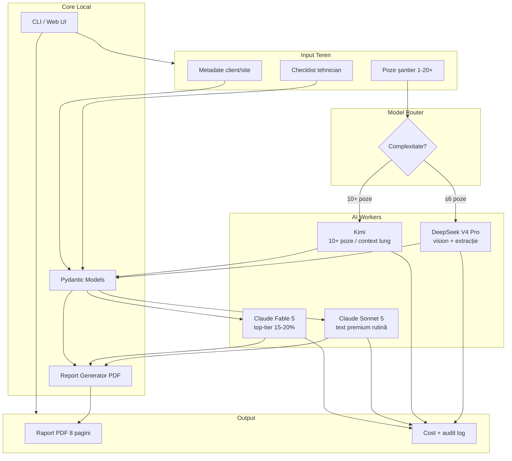

# SOLARIS CET — Planificare Executivă v2.0

**Proiect:** AI-Powered Solar Site Survey & Professional Report System  
**Versiune plan:** 2.0 (revizuită după audit workspace)  
**Data:** 5 iulie 2026  
**Status real:** Documentație + logo livrate · Cod sursă **neexistent în workspace**

---

## 0. AUDIT STARE CURENTĂ (verificat 5 iulie 2026)

### Ce există fizic în `SOLARIS CET/`

| Fișier | Rol | Status |
|---|---|---|
| `global.md` | Strategie multi-model | ✅ Complet |
| `BUGET_FABLE5_API.md` | Buget Claude detaliat | ✅ Complet, cu calcule reale |
| `grok.md` | Note PM | ✅ Aliniat cu Claude Console |
| `LOGO SOLARIS CET.jpg` | Branding raport | ✅ Disponibil |
| `PLAN_SOLARIS_CET_FINAL.md` | Planificare | 🔄 Revizuit acum (v2.0) |

### Ce lipsește (planul v1.0 le marca ca livrate, dar nu sunt în workspace)

| Componentă | Referință v1.0 | Realitate |
|---|---|---|
| `src/models.py` | Livrat | ❌ Lipsește |
| `src/report_generator.py` | Livrat | ❌ Lipsește |
| `src/cli.py` | Livrat | ❌ Lipsește |
| `prompts/photo_analysis_v1.txt` | Livrat | ❌ Lipsește |
| `tests/` (5 teste) | Trec | ❌ Lipsește |
| Path `/home/workdir/solaris/` | Menționat | ❌ Path Linux din alt mediu |

**Concluzie audit:** Strategia, bugetul și routing-ul sunt solide. Execuția tehnică trebuie **construită de la zero** în acest workspace. Planul v2.0 reflectă această realitate.

---

## 1. REZUMAT EXECUTIV

SOLARIS CET reduce documentarea pe șantier de la **45–90 min** la **sub 20 min** prin:
1. Analiză foto AI (vision)
2. Checklist structurat
3. Raport PDF profesional, permit-ready

**Obiectiv imediat:** reconstruiere MVP v0.1 funcțional în 7–10 zile, apoi integrare API multi-model în v0.2.

**Buget API lunar țintă:** ~40€ (Claude ~20€ + Kimi ~20€ + DeepSeek neglijabil)

---

## 2. KPI ȘI CRITERII DE SUCCES

| KPI | Țintă | Cum se măsoară |
|---|---|---|
| Timp end-to-end | < 20 min | Cronometru de la upload poze → PDF final |
| Calitate raport | Permit-ready | Review manual pe 3 rapoarte reale |
| Cost per raport | < €0.50 medie | `response.usage` logat per apel |
| Fiabilitate layout PDF | 0 erori majore | Teste automate + review vizual |
| Consistență | Indiferent de tehnician | Același input → structură identică |

---

## 3. ARHITECTURĂ SISTEM



### Reguli de routing (production)

| Tip job | Model | Motiv |
|---|---|---|
| ≤6 poze, extracție + checklist | **DeepSeek V4 Pro** | Rapid, ieftin, vision bun |
| 10+ poze sau documente lungi | **Kimi** | Long-context + multi-image |
| Text premium rutină (80%) | **Claude Sonnet 5** | $2/$10 intro, ~$0.045/raport |
| Top-tier: AHJ, clienți mari (15–20%) | **Claude Fable 5** | Doar text extras, fără poze |
| Planificare + review final | **Grok Heavy** | Orchestrator |

**Regula de aur:** Fable 5 și Sonnet 5 primesc **doar text** extras de DeepSeek/Kimi — niciodată imagini.

---

## 4. FLUX UTILIZATOR (end-to-end)

```
[1] Tehnician pe șantier
    ↓ face 4–12 poze (acoperiș, panouri, tablou, umbrire, acces)
[2] Completează checklist (orientare, suprafață, obstacole, consum)
    ↓
[3] Upload în SOLARIS CET (CLI v0.1 → Web v0.2)
    ↓
[4] Model Router alege DeepSeek sau Kimi
    ↓ analiză vision → JSON structurat (Pydantic)
[5] Router scriere: Sonnet 5 (default) sau Fable 5 (flag premium)
    ↓ executive summary + recommendations
[6] Report Generator → PDF 8 pagini cu logo, tabele, poze embedate
    ↓
[7] Tehnician descarcă / trimite clientului
    Total țintă: < 20 minute
```

---

## 5. STRUCTURĂ PROIECT ȚINTĂ

```
SOLARIS CET/
├── src/
│   ├── __init__.py
│   ├── models.py              # Pydantic: SiteSurvey, PhotoAnalysis, Report
│   ├── report_generator.py    # PDF 8 pagini, branding SOLARIS CET
│   ├── photo_analyzer.py      # Vision pipeline + prompt loading
│   ├── model_router.py        # Alege modelul optim per job
│   ├── api_clients/
│   │   ├── deepseek.py
│   │   ├── kimi.py
│   │   ├── claude.py          # Sonnet 5 + Fable 5
│   │   └── cost_logger.py
│   └── cli.py
├── prompts/
│   ├── photo_analysis_v1.txt
│   ├── executive_summary_v1.txt
│   └── system_solaris_v1.txt    # Static, ≥2048 tokeni (cache-able)
├── tests/
│   ├── test_models.py
│   ├── test_report_generator.py
│   ├── test_model_router.py
│   └── fixtures/              # Sample data + poze test
├── output/                    # PDF-uri generate
├── .env.example               # API keys template
├── pyproject.toml
├── global.md
├── BUGET_FABLE5_API.md
└── LOGO SOLARIS CET.jpg
```

---

## 6. PLAN DE EXECUȚIE (faze + sprint-uri)

### Faza 0 — Setup (Ziua 1–2)

| Task | Livrabil | Criteriu acceptare |
|---|---|---|
| Inițializare proiect Python | `pyproject.toml`, venv | `pip install -e .` funcționează |
| `.env.example` cu toate cheile | Template securizat | 4 provideri documentați |
| Modele Pydantic | `src/models.py` | Validare strictă, sample data |
| Logo în assets | Copiat în `assets/logo.jpg` | Embedabil în PDF |

**Dependențe:** Python 3.11+, reportlab/weasyprint, pydantic, httpx, pillow

---

### Faza 1 — MVP v0.1 Core (Ziua 3–7)

| Task | Prioritate | Criteriu acceptare |
|---|---|---|
| `report_generator.py` | P0 | PDF 8 pagini: cover, site info, analiză, checklist, recomandări, poze, concluzii |
| `photo_analysis_v1.txt` | P0 | Prompt vision acționabil, nu generic |
| `cli.py` demo | P0 | `solaris generate --demo` → PDF în `output/` |
| CLI real (mock data) | P1 | `solaris generate --photos ./poze --checklist data.json` |
| 5+ teste automate | P0 | `pytest` verde, layout + modele |
| Sample report | P0 | 1 PDF validat vizual cu logo |

**Milestone v0.1:** PDF profesional generat local, fără API live (date mock sau manual).

---

### Faza 2 — Integrare AI v0.2 (Săptămâna 2–3)

| Task | Prioritate | Criteriu acceptare |
|---|---|---|
| `api_clients/deepseek.py` | P0 | Vision pe 1–6 poze → JSON valid |
| `api_clients/kimi.py` | P1 | Vision pe 10+ poze |
| `api_clients/claude.py` | P0 | Sonnet 5 + Fable 5 cu parametri corecți (vezi BUGET) |
| `model_router.py` | P0 | Rutare automată după nr. poze + flag premium |
| `cost_logger.py` | P0 | Log `usage` per raport, alertă la $15 |
| Testare pe șantier real | P0 | 1 raport complet < 20 min |

**Parametri Fable 5 obligatorii** (din `BUGET_FABLE5_API.md`):
- `output_config: {effort: "medium"}`
- System prompt static ≥2048 tokeni + `cache_control`
- `max_tokens: 4000`
- Fără poze, fără `temperature`/`thinking` explicit

---

### Faza 3 — Interfață v0.2 (Săptămâna 3–4)

**Decizie recomandată:** Gradio sau FastAPI + HTML simplu (nu React complet încă).

| Opțiune | Pro | Contra | Recomandare |
|---|---|---|---|
| **Gradio** | Rapid, 2–3 zile, upload poze nativ | Mai puțin customizabil | ✅ Start aici |
| **Streamlit** | Similar Gradio | Performanță la multe poze | Alternativă |
| **FastAPI + React** | Scalabil, profesional | 2+ săptămâni extra | v0.3 |

| Task | Criteriu acceptare |
|---|---|
| Upload poze drag-and-drop | Max 20 poze, preview |
| Form checklist | Câmpuri mapate la Pydantic |
| Toggle „Premium (Fable 5)” | Rutare corectă |
| Progress bar generare | Feedback vizual |
| Download PDF | Fișier final în browser |

---

### Faza 4 — v0.3 (Luna 2)

- Estimare producție solară automată
- Export format AHJ-specific
- Batch processing (mai multe site-uri)
- Dashboard istoric + costuri

### Faza 5 — v1.0 (Luna 3–4)

- App web/desktop completă pentru tehnicieni
- Integrare CRM
- Scalare multi-instalator

---

## 7. BUJET CONSOLIDAT

| Provider | Alocare lunară | Cost/raport | Volum estimat |
|---|---|---|---|
| DeepSeek V4 Pro | ~€2–5 | ~€0.01–0.03 | 100% vision jobs |
| Claude Sonnet 5 | ~€3.60 | ~€0.045 | 80 rapoarte premium |
| Claude Fable 5 | ~€4.50 | ~€0.22 | 20 rapoarte top-tier |
| Kimi | ~€20 | variabil | Site-uri complexe |
| **Total** | **~€30–40** | **~€0.30 medie** | 100 rapoarte/lună |

**Rezervă:** ~50% din bugetul Claude ($8.31 din $20.41) pentru luni aglomerate.

**Anti-pattern-uri** (nu se negociază — detalii în `BUGET_FABLE5_API.md`):
- Poze la Fable 5
- `effort: "xhigh"` pentru scriere
- System prompt cu timestamp (ucide caching)
- Multi-turn conversații cu Fable

---

## 8. STRATEGIE TESTARE

| Nivel | Ce testăm | Când |
|---|---|---|
| Unit | Modele Pydantic, router logic | Fiecare commit |
| Integration | API clients (mock + live) | Înainte de release |
| Visual | Layout PDF (pagini, tabele, logo) | La fiecare schimbare report_generator |
| E2E | Poze reale → PDF complet | Înainte de v0.2 release |
| Cost | Usage logging vs buget | Săptămânal |

**Test de acceptare v0.1:** 3 PDF-uri generate din sample data, zero erori layout.  
**Test de acceptare v0.2:** 1 vizită reală pe șantier, < 20 min, raport comparabil cu cel manual.

---

## 9. RISCURI ȘI MITIGARE

| Risc | Probabilitate | Impact | Mitigare |
|---|---|---|---|
| Cod MVP nu există în workspace | Confirmat | Mare | Faza 0–1: rebuild prioritar |
| Fable 5 refuză cereri (NDR 30 zile) | Medie | Mare | Verifică setările cont Anthropic înainte de integrare |
| Cost API depășește bugetul | Medie | Mediu | Router + alertă $15 + fallback Sonnet 5 |
| Calitate vision slabă pe poze reale | Medie | Mare | Prompt iterativ + fallback Kimi |
| PDF layout broken pe Windows | Scăzut | Mediu | Teste vizuale + fonturi embedded |
| API key expus în cod | Scăzut | Critic | `.env` + `.gitignore`, niciodată în repo |

---

## 10. DECIZII NECESARE (cu recomandări)

| # | Decizie | Opțiuni | Recomandare |
|---|---|---|---|
| 1 | Ordine execuție | UI first vs API first | **API first** — CLI funcțional apoi UI |
| 2 | UI v0.2 | Gradio / Streamlit / FastAPI | **Gradio** — cel mai rapid la valoare |
| 3 | PDF engine | ReportLab / WeasyPrint | **ReportLab** — control fin tabele |
| 4 | Prima integrare API | DeepSeek / Claude / Kimi | **DeepSeek** — vision default, cel mai ieftin |
| 5 | Testare inițială | Mock data / poze reale | **Ambele** — mock pentru CI, reale pentru validare |

---

## 11. ACȚIUNI IMEDIATE (ordine strictă)

### Săptămâna curentă

1. **[P0] Setup proiect** — structură foldere, `pyproject.toml`, dependențe
2. **[P0] `models.py`** — scheme complete SiteSurvey, PhotoAnalysis, ReportData
3. **[P0] `report_generator.py`** — PDF 8 pagini cu logo existent
4. **[P0] `cli.py --demo`** — generează primul PDF din sample data
5. **[P0] Teste** — minimum 5 teste, `pytest` verde
6. **[P1] Validare vizuală** — deschide PDF, verifică layout profesional

### Săptămâna viitoare

7. **[P0] Integrare DeepSeek vision** — analiză foto reală
8. **[P0] Integrare Claude Sonnet 5** — text premium
9. **[P1] Model router** — rutare automată
10. **[P1] Test pe șantier real** — 5–6 poze + checklist

### După MVP validat

11. **[P1] UI Gradio** — upload + download
12. **[P2] Integrare Kimi** — site-uri complexe
13. **[P2] Cost dashboard** — logging per raport

---

## 12. ROADMAP REVIZUIT (timeline realist)

```
Iulie 2026
├── S1 (5–11 iul):  Faza 0–1 → MVP v0.1 rebuild (PDF + CLI + teste)
├── S2 (12–18 iul): Faza 2   → API DeepSeek + Claude + router
└── S3 (19–25 iul): Faza 3   → UI Gradio + test șantier real

August 2026
├── v0.3: Producție solară + batch + dashboard costuri
└── Optimizare prompturi + caching Claude

Septembrie–Octombrie 2026
└── v1.0: App completă + CRM + scalare
```

---

## 13. STANDARDE DE CALITATE (neschimbate)

- Rapoarte PDF la nivel firmă de inginerie
- Zero erori layout, text tăiat, imagini distorsionate
- Analiză foto **acționabilă** — nu descrieri generice
- Teste automate obligatorii înainte de orice release
- Documentația actualizată la fiecare milestone

---

## 14. CONCLUZIE

Planul v1.0 avea strategie și buget excelente, dar **supraestima livrabilele tehnice**. Planul v2.0:

- Reflectă starea reală a workspace-ului (documentație, fără cod)
- Definește structura proiect, faze, criterii de acceptare
- Prioritizează rebuild MVP în 7 zile înainte de UI sau API premium
- Păstrează strategia multi-model și regulile de cost din `BUGET_FABLE5_API.md`
- Oferă timeline realist și decizii cu recomandări clare

**Următorul pas concret:** începe Faza 0 — setup proiect + `models.py` + primul PDF demo.

---

**SOLARIS CET**  
*Reduce birocrația. Crește calitatea. Fă-o bine de prima dată.*

**Planificare v2.0 — audit + execuție — 5 iulie 2026**