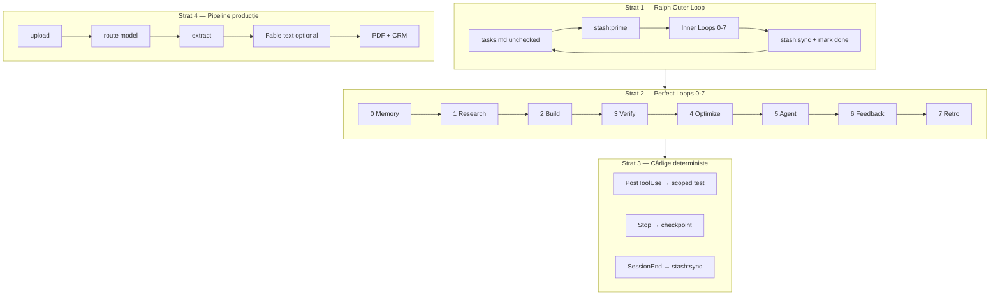

# SOLARIS CET — Master Loops v3 (Ralph × Stash × Fable 5)

**Versiune:** 3.1 · **2026-07-06** (+ Consulting Loops v4 — vezi `CONSULTING-SOLUTIONS.md`)  
**Filozofie:** *Boil the ocean. Fresh context per task. Memory before motion. Verify in code, not in chat.*

Sinteză din cele mai bune pattern-uri open-source (2024–2026), adaptate la monorepo-ul tău: React 19 + Vite, `survey-engine` Python, multi-model (Grok · DeepSeek · Kimi · **Claude Fable 5**), Stash memory.

> **Notă Fable 5:** Nu există tag GitHub public „Claude Fable 5”. În OSS apare ca `claude-opus-4` / `claude-sonnet-4-6`. La tine = tier **Most capable** din Claude Console — text premium + research, **fără poze**.

---

## Surse de referință (ingineri & comunități de top)

| # | Proiect | ★ | Ce furăm |
|---|---|---:|---|
| 1 | [Fergana Stash](https://github.com/Fergana-Labs/stash) | ~130 | Memory Loop, 12 reguli, self-sufficient, checkpoint |
| 2 | [obra/superpowers](https://github.com/obra/superpowers) | ~247k | Subagent per task, TDD, verify-before-done |
| 3 | [github/spec-kit](https://github.com/github/spec-kit) | ~118k | Spec → plan → tasks → converge |
| 4 | [bmad-code-org/BMAD-METHOD](https://github.com/bmad-code-org/BMAD-METHOD) | ~50k | Faze agile, persona agents, scale-adaptive |
| 5 | [michaelshimeles/ralphy](https://github.com/michaelshimeles/ralphy) | ~2.9k | Outer `while` loop, worktrees, task YAML |
| 6 | [tzachbon/smart-ralph](https://github.com/tzachbon/smart-ralph) | ~411 | Stop-hook, 4-phase task, `.ralph-state.json` |
| 7 | [anthropics/claude-code](https://github.com/anthropics/claude-code) | ~136k | Hooks PostToolUse, skills, `/verify` |
| 8 | [SWE-agent/mini-swe-agent](https://github.com/SWE-agent/mini-swe-agent) | ~5.6k | Linear trajectory, cost/step limits |
| 9 | [Aider-AI/aider](https://github.com/Aider-AI/aider) | ~47k | Lint/test după edit, repo map |
| 10 | [langchain-ai/langgraph](https://github.com/langchain-ai/langgraph) | ~37k | Checkpoint runtime pipeline (nu coding agent) |
| 11 | [OpenHands/OpenHands](https://github.com/OpenHands/OpenHands) | ~80k | Automations, multi-backend agents |
| 12 | [Henry Dowling — Agent Velocity](https://henrydowling.com/agent-velocity.html) | — | Transcript audit, -49% rework cu memorie |

**Local (deja în repo):** `solaris-perfect-loops` SKILL · `agent-memory.md` · `stash:prime/sync/verify`

---

## Arhitectura în 3 straturi



---

## Strat 1 — Ralph Outer Loop (autonomie multi-zi)

Rulează cât timp există task-uri nebifate în `docs/planning/features/<slug>/tasks.md`.

```bash
npm run loops:next              # afișează următorul task + VERIFY
npm run loops:status            # status toate epics (done/open %)
npm run loops:refine -- <file> "<instruction>"  # Loop 4 DeepSeek doc refine
npm run aider -- "task"         # Aider wrapper (pip install aider-chat)
npm run stash:prime -- <slug>   # Loop 0 pentru acel feature
# … inner loops 0-7 …
npm run stash:sync              # Loop 7
# marchează [x] în tasks.md
```

**Reguli Ralph (din Huntley / ralphy / smart-ralph):**
1. **Un task = un context fresh** — nu tragi 50 fișiere în același thread
2. **POC first** — make it work → refactor → test → quality gates
3. **Max 3 retry** per task, apoi BLOCKED + retro
4. **State în fișiere**, nu în chat: `tasks.md` + `.progress.md`

---

## Strat 2 — Inner Loops 0–7 (obligatorii, fiecare task)

| Loop | Nume | OODA | PDCA | Comandă / acțiune |
|---:|---|---|---|---|
| **0** | Memory | Observe | — | `npm run stash:prime -- <topic>` |
| **1** | Research | Orient | Plan | Citește callers, `global.md`, `features/*/design.md` |
| **2** | Build | Act | Do | Cod chirurgical + teste în același pas |
| **3** | Verify | Observe | Check | `survey:smoke`, `verify:fast`, `dev:local`, curl |
| **4** | Optimize | Decide | — | Routing cost (tabelul de mai jos) |
| **5** | Agent | Act | Do | Subagent per rol (Grok/DeepSeek/Fable/Kimi) |
| **6** | Feedback | Orient | Act | Fix în aceeași sesiune + update `grok.md` |
| **7** | Retro | Decide | Act | `stash:sync` + `agent-memory.md` dacă anti-pattern |

**Checkpoint obligatoriu (Stash Rule 10):**
```
DONE: …
VERIFIED: <comandă> → <rezultat>
LEFT: …
BLOCKED: …
```

---

## Strat 3 — Loop routing modele (Fable 5 gate)

| Job | Model | Buget | Când |
|---|---|---|---|
| Orchestrare, review, memory | **Grok Heavy** | — | Mereu manager |
| Cod, vision ≤6 poze, checklist | **DeepSeek V4 Pro** | ~€0.01/raport | Default build |
| Text premium rutină (AHJ, summary) | **Claude Sonnet 5** | $2/$10 intro | 80% text premium |
| Research ambiguu, top-tier, clienți mari | **Claude Fable 5** | $10/$50 · ~$0.22/raport | **≤15–20%** rapoarte |
| 10+ poze, context lung | **Kimi** | ~€20/lună | `model_router.py` |
| Subagent implementare | **DeepSeek** | — | Fișiere noi |
| Subagent review cod | **Grok** sau Sonnet 5 | — | După build |

**Fable 5 Loop (text only):**
```
1. DeepSeek/Kimi extrage JSON structurat (fără poze la Fable)
2. Gate: premium_flag OR client_tier=enterprise OR ahj_complexity=high
3. Fable primește: system prompt cache-uit + JSON extras
4. Batch API dacă nu e urgent (-50% cost)
5. Log usage → admin analytics + SURVEY_COST_BUDGET_USD
6. VERIFY: pytest cost mock + sample output structure
```

**Interzis:** Fable 5 pentru bulk coding, vision, sau „just in case”.

---

## Strat 4 — Domain Loops (toate ideile proiectului)

Fiecare domeniu = mini-secvență **R→B→V** (Research→Build→Verify) sub Loop-urile 1–3.

### D1 — Field Survey (șantier `/survey`)
| Pas | Acțiune | Verify |
|---|---|---|
| R | `SurveyPage.tsx`, IndexedDB, `photo_metadata.py` | — |
| B | Upload + checklist + GPS + județ dropdown | Vitest route |
| V | `dev:local` → `/survey` + `survey:smoke` | E2E `survey.spec.ts` |

### D2 — AI Vision Pipeline
| Pas | Acțiune | Verify |
|---|---|---|
| R | `pipeline.py`, `model_router.py`, prompts | — |
| B | Routing DeepSeek/Kimi după nr. poze | pytest pipeline |
| V | `POST /demo` + mock API keys | 62+ pytest |

### D3 — PDF & AHJ (Fable 5 tier)
| Pas | Acțiune | Verify |
|---|---|---|
| R | `report_generator.py`, `ahj_export.py`, `BUGET_FABLE5_API.md` | — |
| B | PDF 8 pagini + AHJ enriched GPS | pytest PDF |
| V | Sample PDF visual + cost log | `< €0.50/raport medie` |

### D4 — CRM, Leads, Webhooks
| Pas | Acțiune | Verify |
|---|---|---|
| R | `surveyWebhook.ts`, `LeadsSection`, Telegram | — |
| B | `surveyReportId` în lead, webhook retry | Vitest CRM |
| V | POST `/api/survey/crm` mock | admin load |

### D5 — Frontend, SEO, B2B UX
| Pas | Acțiune | Verify |
|---|---|---|
| R | `SOLARIS_CET_AI_ARCHITECTURE_CURSOR_GUIDE.md`, sitemap | — |
| B | Vite/React, Tailwind v4, HTML-first SEO | `npm run lint` |
| V | `lighthouse:audit`, Googlebot curl | CWV gates |

### D6 — Deploy & Ops (Coolify / Gitea / Hetzner)
| Pas | Acțiune | Verify |
|---|---|---|
| R | `COOLIFY_SETUP_RO.md`, `git remote -v` | — |
| B | Push **solaris-clean** only, env secrets | — |
| V | `survey:post-deploy` | prod `/api/survey/health` 200 |

### D7 — PWA Offline (șantier fără semnal)
| Pas | Acțiune | Verify |
|---|---|---|
| R | `PWA_OFFLINE_BACKLOG_100.md`, draft queue | — |
| B | IndexedDB + auto-sync la reconectare | Vitest draft |
| V | DevTools offline simulation | sync queue drain |

### D8 — Batch & SaaS (v1.1–v1.2)
| Pas | Acțiune | Verify |
|---|---|---|
| R | `POST /batch`, `INSTALLER_API_KEYS`, rate limit | — |
| B | Tab batch UI + `X-Installer-Key` | pytest + Vitest |
| V | E2E batch tab + `/stats` | `survey:smoke` |

### D9 — Security & Cost
| Pas | Acțiune | Verify |
|---|---|---|
| R | `AGENT_RULEPACK.md`, `SECURITY_HARDENING_RUNBOOK.md` | — |
| B | Rate limit, no secrets in repo, CORS | audit |
| V | `npm run audit:prod` | budget în `/health` |

### D10 — Enterprise viitor (3D, Digital Twin, Bridge)
| Pas | Acțiune | Verify |
|---|---|---|
| R | `BRIDGE_SIMULATOR_RO.md`, Spline/Sketchfab guide | — |
| B | Feature flag + modul separat | nu pe critical path |
| V | Lighthouse + izolare bundle | zero regressii survey |

### D11 — Conversion (calculator → survey → ofertă)
| Pas | Acțiune | Verify |
|---|---|---|
| R | `contactPrefill.ts`, `surveyPrefill.ts` | — |
| B | `?from=calculator` prefill + CTA ofertă | Vitest prefill |
| V | E2E calculator → survey → contact | funnel intact |

### D12 — Multi-Agent Orchestra
| Pas | Rol | Model |
|---|---|---|
| Plan + task breakdown | PM | Grok |
| Implementare | Worker | DeepSeek |
| Text raport final | Writer | Sonnet 5 / Fable 5 |
| Review + retro | QA | Grok |
| Memory consolidate | Archivist | Grok → `stash:sync` |

---

## Comenzi canonice (copy-paste)

```bash
# Început sesiune / task
npm run stash:prime -- survey deploy
npm run loops:next

# Dev + verify
npm run dev:local
npm run survey:smoke
npm run verify:fast

# După task
npm run stash:sync
npm run stash:verify

# După VPS
SITE_URL=https://solaris-cet.com npm run survey:post-deploy

# Epic multi-zi (opțional)
# ralphy --yaml docs/planning/features/<slug>/tasks.yaml
```

---

## Template task (superpowers + spec-kit)

```markdown
- [ ] <titlu scurt>
  - **Domain:** D4 CRM
  - **Files:** `app/api/lib/surveyWebhook.ts`
  - **MODEL:** DeepSeek (code) · Grok (review) · Fable 5 (doar dacă copy AHJ)
  - **VERIFY:** `npm run verify:fast && cd survey-engine && pytest tests/test_webhook.py -q`
  - **DONE when:** webhook retry 3x + test green + line în `global.md`
```

---

## Adoptare (ordine impact / efort)

| Prioritate | Acțiune | Efort |
|:---:|---|:---:|
| P0 | Rulează 0→7 pe fiecare task (deja) | — |
| P0 | `tasks.md` per feature următor | S |
| P1 | `npm run loops:next` + template folder | S |
| P1 | Hooks verify scoped (`.claude/settings.json`) | M |
| P2 | Outer Ralph cu ralphy YAML (epics) | M |
| P3 | LangGraph checkpoint pe batch pipeline | L |

---

## North Star

**SOLARIS-Ralph-Perfect v3:**

```
while tasks remain:
  PRIME(stash) → PICK(loop:next) → RESEARCH → BUILD+tests
  → VERIFY(hooks+smoke) → ROUTE(models) → RETRO → SYNC(stash)
→ POST_DEPLOY when VPS ready
```

Skill operativ: `.claude/skills/solaris-perfect-loops/SKILL.md`  
Anti-pattern ledger: `docs/planning/agent-memory.md`