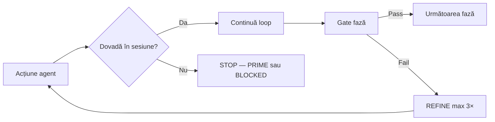

# Anti-Halucinații Loop — Gates în Perfect Loops × AUTOPROMPT × AEP (v2.0 Mature)

**Versiune:** 2.0 Mature · **2026-07-09**  
**Bază:** `anti-halucinatii.md` · `SOLARIS-LOOPS-MASTER.md` · `AUTOPROMPT.md` · `AGENT-ENGINEERING.md`  
**Caz canon:** Grok Code a declarat progres fără commit — Recovery = `git diff` + pytest, nu memorie chat

---

## §0 — Adult brief

`anti-halucinatii.md` = cele 12 legi + ierarhia adevărului.  
**Acest fișier** = **capcane per fază** + **gate determinist** care oprește minciuna înainte de DONE.

**Nu există „skip verify”** nici în `--mode fast` AUTOPROMPT. Fast = mai puțină proză CRITIQUE, **nu** mai puțină realitate.

Neonat: „ar trebui să treacă”. Adult: exit code + `142 passed` copiat literal.

---

## §1 — Principiu de operare



---

## §2 — Mapare Perfect Loops 0–7 → Anti-Halucinație

| Loop | Fază AEP | Capcană #1 | Capcană #2 | Gate obligatoriu |
|---:|---|---|---|---|
| **0** Memory | P0 | „Știu deja proiectul” din training | Stash absent → re-derivare | `stash:prime` + MEMORY_PRIME |
| **0b** Graph | P0 | Grep masiv, path-uri greșite | Ignoră graphify-out | `graphify:prime` ≥5 nodes |
| **1** Research | P1 | Plan din nume fișier, fără Read | Success criterion vag | SPEC = **o comandă** |
| **2** Build | P2 | Edit fără Read; drive-by | Test „pentru formă” | diff ⊆ BLAST_RADIUS; gate_mic |
| **3** Verify | P3 | „Lint mental”; verify inventat | User testing | `npm run verify` / domain gate |
| **4** Optimize | P5 | Fable 5 pe tot repo | Cost fictiv fără gate | AEP tier table |
| **5** Agent | P5 | Subagent fără brief | Context duplicat | packet + verify_command |
| **6** Feedback | P6 | Ignoră BLOCKER HANDOFF | grok.md aspirational | doar fapte verify-verde |
| **7** Retro | P6 | stash:sync fără verify | [x] tasks.md mințind | sync după gate verde |

---

## §3 — AUTOPROMPT v4.5 — Anti-Halucinație per fază

### Faza 0: PRIME

| Pas | Acțiune | Anti-halucinație |
|---|---|---|
| P0.1 | `stash:prime` | Notează fișiere returnate — nu inventa istoric |
| P0.2 | `graphify:prime` | 5–12 **node-uri cu path real** |
| P0.3 | Read țintit | Doar din listă — nu „probabil în src/” |

**Gate PRIME:** `Key files read:` + path-uri confirmate (Glob/graphify).  
**Refuză** dacă graphify lipsește și începi grep masiv fără justificare.

---

### Faza 1: DECOMPOSE

Fiecare subtask **T1…Tn**:

```yaml
id: T2
objective: <o propoziție>
success: <comportament observabil>
verify_command: <exact string shell>
anti_hallucination_trap: <ce ar minți aici>
```

**Bune (SOLARIS):**
- `cd survey-engine && python -m pytest tests/test_router.py -q`
- `cd app && npm run test -- src/__tests__/twinReplayRoute.test.ts`

**Respinse:** „UI arată bine”, „Codul e corect”, „Ar trebui să treacă CI”

---

### Faza 2: PLAN + N-BEST

Scor 1–5: **Verifiability** (×2), Simplicity, Risk, Token cost.  
Alege **Verifiability maximă**, nu „elegant pe hârtie”.

**Gate PLAN:** fiecare pas are `verify_command` — altfel reDECOMPOSE.

---

### Faza 3–4: EXECUTE + VERIFY (Micro-Loop)

| După edit | Gate minim |
|---|---|
| TypeScript | `npm run typecheck` sau vitest țintit |
| Python engine | `pytest <test_file> -q` |
| Route API nou | `surveyRouteRegistry.test.ts` |
| Script npm nou | `node scripts/… --help` sau dry-run |

```
READ → EDIT → GATE_MIC → (fail? diagnose) → pass → next
```

**Interzis:**
- `done: true` în `.autoprompt/state-*.json` fără comandă rulată
- AUTOPROMPT stub `current.done = true` = livrare reală (**HALUCINATION_RISK: high**)

---

### Faza 5: CRITIQUE (P4 Adversarial)

```markdown
Demonstrația pretinde: {{DONE}}
Verificarea pretinde: {{VERIFIED}}

Atacă cu 7 lentile (1-10 + dovadă lipsă):
1. Fișier/path există?
2. Comanda există în package.json?
3. Output verify e din sesiunea curentă?
4. Testele acoperă comportamentul nou?
5. Edge case care rupe soluția?
6. Windows/CI compat?
7. Scope creep în diff?

Pentru scor <8: un input concret care ar strica sistemul.
Verdict: ACCEPT | REJECT — motiv o propoziție.
```

**Gate CRITIQUE:** ACCEPT doar dacă lentilele 1–3 ≥ 8.

---

### Faza 6: REFINE + RETRY

| Încercare | Cerință |
|---:|---|
| 1 | Root cause — **nu** aceeași comandă |
| 2 | Abordare N-best #2 |
| 3 | BLOCKED + HANDOFF |

Nu raporta „blocked by environment” fără stderr din comandă rulată.

---

### Faza 7: GLOBAL VERIFY

```bash
npm run verify:fast
cd survey-engine && python -m pytest tests/ -q
# Dacă task atinge app complet:
cd app && npm run verify
```

**Gate GLOBAL:** număr teste + exit code în checkpoint — nu „totul verde”.

---

### Faza 8: META-LEARN

1. Unde am fost tentat să afirm fără dovadă?
2. Ce gate a prins halucinația?
3. O îmbunătățire concretă pentru `anti-halucinatii.md` sau skill

---

### Faza 9: HANDOFF + COMMIT

| Câmp | Regulă |
|---|---|
| DONE | Doar ce e în diff sau output |
| VERIFIED | Comenzi + rezultate **copiate literal** |
| EVIDENCE | Path-uri citite |
| LEFT | Muncă necommitată dacă `git status` dirty |
| BLOCKED | BLOCKER extern din HANDOFF — nu „rezolvat” din chat |
| COMMIT | „Necommitat” dacă userul nu a cerut commit |

---

## §4 — Ralph Outer Loop overlay

```bash
npm run loops:next          # sursă task — nu inventa
npm run stash:prime -- …    # Loop 0
# inner 0-7 cu gates de mai sus
npm run stash:sync          # doar după verify
# [x] tasks.md              # doar dacă gate task trecut
```

**Regulă Ralph:** `loops:next` = „No open tasks” → `10_HARD_RANDOM_TASKS.md` sau `improve:next` — **nu fabrica** taskuri.

---

## §5 — Recovery Loop (Grok Code / sesiune întreruptă)

**Trigger:** terminal închis · agent nou · `git status` necunoscut

```bash
# RECOVERY-0 — adevărul despre disc
git status --short
git diff --stat

# RECOVERY-1 — memorie
npm run stash:prime -- "recovery interrupted session"
head -60 docs/planning/HANDOFF.md

# RECOVERY-2 — autoprompt state
ls .autoprompt/
# citește state-*.json — nu crede done:true

# RECOVERY-3 — gate înainte de edit nou
# rulează verify_command din task ACUM
```

```
DONE: <evaluat din diff + teste, NU din chat vechi>
VERIFIED: <comenzi rulate acum>
EVIDENCE: git diff --stat + paths citite
LEFT: <task întrerupt>
BLOCKED: -
RECOVERED_FROM: interrupted session | Grok Code
HALLUCINATION_RISK: high until RECOVERY-3 pass
```

---

## §6 — Hook-uri deterministe

| Hook | Când | Acțiune |
|---|---|---|
| Pre-Edit | înainte Write/StrReplace | path ∈ `Key files read`? |
| Post-Edit | după fiecare fișier | gate_mic domeniu |
| Pre-DONE | înainte checkpoint | checklist `anti-halucinatii.md` |
| SessionEnd | crash/timeout | `.autoprompt/recovery.md` + git status |

---

## §7 — AUTOPROMPT runner (`scripts/autoprompt.mjs`)

| Output runner | Semnificație |
|---|---|
| `✅ AUTOPROMPT session checkpoint` | Structură rulată — **nu** verify produs |
| `current.done = true` fără pytest/vitest | **HALUCINATION_RISK: high** |
| `--mode fast` | Skip proză CRITIQUE, **nu** skip comenzi |

**Fix v5 țintă:** refuză `phase: DONE` fără `verify_output` în state JSON.

---

## §8 — Comenzi de referință (nu inventa altele)

| Domeniu | Gate real |
|---|---|
| App | `cd app && npm run verify` |
| Fast cross | `npm run verify:fast` |
| Survey engine | `cd survey-engine && python -m pytest tests/ -q` |
| Smoke | `npm run survey:smoke` |
| Loops | `npm run loops:status` |
| Graph | `npm run graphify:suggest -- "<topic>"` |
| Memorie | `npm run stash:verify` |
| Prod | `npm run deploy:status` (SOFT_FAIL=1 dacă DNS Shopify) |

**Ficțiuni interzise:** `verify:all`, `npm run test:all`, `../node_modules/.bin/*`

---

## §9 — Catalog incidente × loop (din agent-memory)

| ID | Loop rupt | Simptom | Gate care prinde |
|---|---|---|---|
| H-01 | 3 | `verify:all` | package.json scripts |
| H-02 | 7 | Push GitHub nu Gitea | `git remote -v` în LEFT |
| H-05 | 2 | Route fără index.cjs | surveyRouteRegistry.test.ts |
| H-07 | 0 | „Am terminat” după crash | Recovery §5 |
| H-08 | 3 | AUTOPROMPT stub done | pytest output obligatoriu |

---

## §10 — Checklist orchestrator (subagent return)

- [ ] `VERIFIED` cu comandă + rezultat literal?
- [ ] `EVIDENCE` sau code citations?
- [ ] `HALLUCINATION_RISK` onest dacă ceva n-a rulat?
- [ ] `tasks.md [x]` doar după gate task?
- [ ] Recovery: §5 complet dacă sesiune întreruptă?
- [ ] `OBSERVER: clear` sau halt rezolvat?

---

## §11 — Rubrică neonat vs adult

| | Neonat (v1) | Adult (v2) |
|---|---|---|
| PRIME | grep tot repo | graph_nodes 5–12 |
| DECOMPOSE | „fix bug” | verify_command per subtask |
| EXECUTE | verify la final | gate_mic per edit |
| VERIFY | „totul verde” | 142 passed, exit 0 |
| HANDOFF | uită git dirty | LEFT cu git status |
| Recovery | trust chat | git diff + rerun gate |

---

## §12 — Prompt fază (lipire AUTOPROMPT `core-system.md`)

```markdown
## Anti-Halucinație Loop (obligatoriu v2)

În fiecare fază:
- PRIME: path-uri confirmate graphify/stash
- DECOMPOSE: verify_command per subtask
- EXECUTE: READ înainte de EDIT; gate_mic după edit
- VERIFY: output literal; exit code obligatoriu
- CRITIQUE: demonstrează că e fals
- HANDOFF: git status pentru necommitat

Încalci = reia PRIME. Nu există DONE fără VERIFIED din sesiunea curentă.
Citește: docs/planning/anti-halucinatii-loop.md
```

---

## §13 — Evoluție

| Versiune | Conținut |
|---|---|
| v1.0 | protocol inițial Loops + AUTOPROMPT |
| **v2.0 Mature** | incidente SOLARIS, rubrică, recovery Grok Code, orchestrator checklist |
| v2.1 țintă | autoprompt.mjs refuză DONE fără verify_output |
| v2.2 țintă | PostToolUse hook gate_mic în settings |

---

**Părinte:** `anti-halucinatii.md` · **Observer:** `grok-loop-observer.md` · **Memory:** `loop-memory.md`