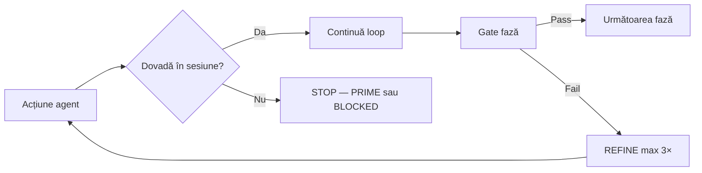

# Anti-Halucinații Loop — Integrare Perfect Loops × AUTOPROMPT × AEP

**Proiect:** SOLARIS CET  
**Versiune:** 1.0  
**Data:** 2026-07-09  
**Bază:** `anti-halucinatii.md` · `SOLARIS-LOOPS-MASTER.md` · `AUTOPROMPT.md` · `AGENT-ENGINEERING.md`  
**Scop:** fiecare fază de loop are **capcane de halucinație cunoscute** și **gate determinist** care oprește minciuna înainte de DONE.

---

## Principiu de operare



**Nu există „skip verify”** nici în `--mode fast` AUTOPROMPT. Fast = mai puțină proză, **nu** mai puțină realitate.

---

## Mapare: Perfect Loops 0–7 → Anti-Halucinație

| Loop | Fază AEP | Capcană #1 | Capcană #2 | Gate obligatoriu |
|---:|---|---|---|---|
| **0** Memory | P0 | „Știu deja proiectul” din training | Stash absent → re-derivare greșită | `npm run stash:prime -- "<topic>"` |
| **0b** Graph | P0 | Grep pe tot repo-ul, path-uri greșite | Ignoră `graphify-out/` | `npm run graphify:prime -- "<topic>"` |
| **1** Research | P1 | Plan din nume fișier, fără Read | Success criterion vag | Criteriu = **o comandă** sau **un URL** |
| **2** Build | P2 | Edit fără Read; refactor drive-by | Test „pentru formă” | Diff ≤ scope task; teste noi/modificate |
| **3** Verify | P3 | „Lint mental”; verify inventat | User testing | `npm run verify` / domain gate din task |
| **4** Optimize | P5 | Fable 5 pe tot; cost fictiv | | Routing conform AEP tier table |
| **5** Agent | P5 | Subagent fără brief; context duplicat | | Brief = 1 paragraf + paths + gate |
| **6** Feedback | P6 | Ignoră BLOCKER din HANDOFF | | Actualizează `grok.md` doar cu fapte |
| **7** Retro | P6 | `stash:sync` fără verify | Marchează done în tasks.md mințind | `stash:sync` după gate verde |

---

## AUTOPROMPT v4.5 — Anti-Halucinație per fază

### Faza 0: PRIME

**Obiectiv:** context real, minimal, verificabil.

| Pas | Acțiune | Anti-halucinație |
|---|---|---|
| P0.1 | `stash:prime` | Notează ce fișiere Stash a returnat — nu inventa istoric |
| P0.2 | `graphify:prime` | Listează 5–12 **node-uri cu path real** din output |
| P0.3 | Read țintit | Doar fișiere din listă — nu „probabil e în src/” |

**Gate PRIME:** poți enumera `Key files read:` cu path-uri care există (Glob confirmă).

**Refuză PRIME dacă:** graphify lipsește și începi grep masiv fără justificare.

---

### Faza 1: DECOMPOSE

**Obiectiv:** subtaskuri independent verificabile.

Fiecare subtask **T1…Tn** trebuie să aibă:

```yaml
id: T2
objective: <o propoziție>
success: <comandă sau comportament observabil>
verify_command: <exact string shell>
anti_hallucination_trap: <ce ar putea minți aici>
```

**Exemple bune:**
- `verify_command: cd survey-engine && python -m pytest tests/test_router.py -q`
- `verify_command: cd app && npm run test -- src/__tests__/twinReplayRoute.test.ts`

**Exemple respinse:**
- „UI arată bine”
- „Codul e corect”
- „Ar trebui să treacă CI”

---

### Faza 2: PLAN + N-BEST

**Obiectiv:** decizie din opțiuni scorificate, nu din impresie.

Pentru fiecare abordare, scor 1–5 pe:
- **Verifiability** (poți demonstra cu o comandă?)
- **Evidence need** (câte Read-uri necesită?)

Alege abordarea cu **Verifiability maximă**, nu „elegantă pe hârtie”.

**Gate PLAN:** planul enumeră `verify_command` per pas — altfel reDECOMPOSE.

---

### Faza 3–4: EXECUTE + VERIFY (Micro-Loop)

**Regulă:** după **fiecare** edit, un gate mic — nu un verify gigantic la final.

| După edit | Gate minim |
|---|---|
| TypeScript | `npm run typecheck` (din `app/`) sau fișier test țintit |
| Python engine | `pytest <test_file> -q` |
| Route API nou | test route registry + fișier `route.ts` există |
| Script npm nou | `node scripts/… --help` sau dry-run documentat |

**Micro-loop (≤8 turns):**

```
READ → EDIT → GATE_MIC → (fail? diagnose) → GATE_MIC pass → next
```

**Interzis în EXECUTE:**
- Marchează subtask `done: true` în `.autoprompt/state-*.json` fără comandă rulată
- `current.done = true` stub (vezi `autoprompt.mjs`) tratat ca livrare reală

---

### Faza 5: CRITIQUE (P4 Adversarial)

**Rol:** prosecutor, nu advocate.

Prompt judge (Haiku sau același model în mod hostile):

```markdown
Demonstrația pretinde: {{DONE}}
Verificarea pretinde: {{VERIFIED}}

Atacă cu 7 lentile (1-10 + dovadă lipsă):
1. Fișier/path există?
2. Comanda există în package.json?
3. Output verify e din sesiunea curentă?
4. Testele acoperă comportamentul nou?
5. Edge case care rupe soluția?
6. Windows/CI compat?
7. Scope creep în diff?

Pentru fiecare scor <8: un input concret care ar strica sistemul.
Verdict: ACCEPT | REJECT — motiv cu o propoziție.
```

**Gate CRITIQUE:** ACCEPT doar dacă zero gap-uri de dovadă la lentilele 1–3.

---

### Faza 6: REFINE + RETRY

| Încercare | Cerință |
|---:|---|
| 1 | Diagnostic root cause — **nu** aceeași comandă |
| 2 | Abordare diferită (N-best #2) |
| 3 | Documentează BLOCKED + HANDOFF |

**Anti-halucinație:** nu raporta „blocked by environment” dacă nu ai rulat comanda și nu ai stderr.

---

### Faza 7: GLOBAL VERIFY

Înainte de închidere epic / batch AUTOPROMPT:

```bash
# Minim cross-package
npm run verify:fast
cd survey-engine && python -m pytest tests/ -q

# Dacă task atinge app complet
cd app && npm run verify
```

**Gate GLOBAL:** număr teste + exit code în checkpoint — nu „totul verde”.

---

### Faza 8: META-LEARN

Întrebări obligatorii:
1. Unde am fost tentat să afirm fără dovadă?
2. Ce gate a prins o halucinație?
3. Ce adăugăm în `anti-halucinatii.md`?

Scrie **o singură** îmbunătățire concretă — nu eseu.

---

### Faza 9: HANDOFF + COMMIT

| Câmp | Regulă anti-halucinație |
|---|---|
| DONE | Doar ce e în diff sau output |
| VERIFIED | Comenzi + rezultate copiate literal |
| EVIDENCE | Lista path-uri citite |
| LEFT | Include muncă necommitată dacă `git status` arată modificări |
| BLOCKED | BLOCKER extern din HANDOFF.md nu se „rezolvă” din chat |
| COMMIT | Spune „necommitat” dacă userul nu a cerut commit |

**După Grok Code / terminal închis:** următorul agent rulează **Recovery Loop** (secțiunea de mai jos).

---

## Ralph Outer Loop — Overlay anti-halucinație

```bash
npm run loops:next          # sursă task — nu inventa taskuri
npm run stash:prime -- …    # Loop 0
# … inner 0-7 …
npm run stash:sync          # doar după verify
# bifă [x] în tasks.md      # doar dacă gate-ul din task a trecut
```

**Regulă Ralph:** dacă `loops:next` spune „No open tasks”, **nu fabrica** taskuri — folosește `10_HARD_RANDOM_TASKS.md` sau `improve:next` cu output real.

---

## Recovery Loop (sesiune întreruptă / Grok Code)

**Trigger:** terminal închis · agent nou · `git status` cu modificări necunoscute.

```bash
# RECOVERY-0 — adevărul despre disc
git status --short
git diff --stat

# RECOVERY-1 — memorie
npm run stash:prime -- "recovery interrupted session"
cat docs/planning/HANDOFF.md | head -60

# RECOVERY-2 — ce credea autoprompt
ls .autoprompt/
# citește state-*.json relevant

# RECOVERY-3 — nu presupune DONE
# rulează gate-ul taskului curent înainte de orice edit nou
```

**Checkpoint recovery:**

```
DONE: <evaluat din diff + teste, nu din chat vechi>
VERIFIED: <comenzi rulate acum>
EVIDENCE: git diff --stat + fișiere citite
LEFT: <ce lipsește din taskul întrerupt>
BLOCKED: -
RECOVERED_FROM: interrupted session | <agent/tool>
```

---

## Hook-uri deterministe (recomandate orchestrator)

| Hook | Când | Acțiune |
|---|---|---|
| **Pre-Edit** | înainte de Write/StrReplace | path în lista `Key files read`? |
| **Post-Edit** | după fiecare fișier | gate_mic pentru domeniu |
| **Pre-DONE** | înainte de checkpoint | checklist din `anti-halucinatii.md` |
| **SessionEnd** | terminal închis / timeout | scrie `.autoprompt/recovery.md` cu `git status` |

---

## AUTOPROMPT runner — reguli speciale (`scripts/autoprompt.mjs`)

Modurile `--demo` și stub `current.done = true` **nu sunt DONE real**.

Orchestratorul uman sau Grok 4.5 trebuie să trateze:

| Output runner | Semnificație |
|---|---|
| `✅ AUTOPROMPT session checkpoint` | Structură rulată — **nu** verify produs |
| `current.done = true` fără pytest/vitest | **HALUCINATION_RISK: high** |
| `--mode fast` | Skip proză CRITIQUE, **nu** skip comenzi |

**Fix permanent (v5):** runnerul ar trebui să refuze `phase: DONE` dacă `verify_output` lipsește din state JSON.

---

## Prompt fază — lipire în AUTOPROMPT (`core-system.md`)

Adaugă după „Absolute Laws”:

```markdown
## Anti-Halucinație Loop (obligatoriu)

În fiecare fază:
- PRIME: listează path-uri confirmate cu graphify/stash
- DECOMPOSE: fiecare subtask are verify_command
- EXECUTE: READ înainte de EDIT; gate_mic după fiecare edit
- VERIFY: copiază output literal; exit code obligatoriu
- CRITIQUE: încearcă să demonstrezi că e fals
- HANDOFF: git status pentru muncă necommitată

Încalci = reia de la PRIME. Nu există DONE fără VERIFIED din sesiunea curentă.
Citește: docs/planning/anti-halucinatii-loop.md
```

---

## Comenzi de referință (nu inventa altele)

| Domeniu | Gate real |
|---|---|
| App | `cd app && npm run verify` |
| Fast cross | `npm run verify:fast` |
| Survey engine | `cd survey-engine && python -m pytest tests/ -q` |
| Smoke | `npm run survey:smoke` |
| Loops | `npm run loops:status` |
| Graph | `npm run graphify:suggest -- "<topic>"` |
| Memorie | `npm run stash:verify` |
| Prod | `npm run deploy:status` (când DNS e OK) |

---

## Checklist orchestrator (înainte de a accepta munca unui subagent)

- [ ] Checkpoint conține `VERIFIED` cu comandă + rezultat?
- [ ] `EVIDENCE` sau citări cod prezente?
- [ ] `HALLUCINATION_RISK` declarat onest dacă ceva nu s-a putut rula?
- [ ] Task marcat în `tasks.md` doar după gate din task?
- [ ] Sesiune întreruptă: recovery loop rulat?

---

## Evoluție

- **v1.0** — protocol inițial Grok 4.5, integrare Loops + AUTOPROMPT
- **v1.1 (țintă)** — `autoprompt.mjs` refuză DONE fără `verify_output` în state
- **v1.2 (țintă)** — hook PostToolUse în `.claude/settings.json` pentru gate_mic scoped

---

**Folosește acest loop împreună cu `anti-halucinatii.md`.**  
Primul fișier spune *ce* să nu minți; acest fișier spune *când* și *cum* oprești minciuna în fiecare fază.