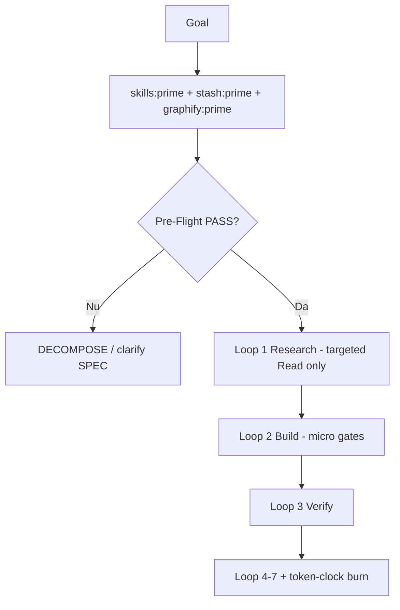

# Superpowers Loops — Integrare în Perfect Loops & AUTOPROMPT

**Bază:** `superpowers.md` · `SOLARIS-LOOPS-MASTER.md` · `AUTOPROMPT.md`

---

## Regula de aur

> **Loop 1 Research nu înseamnă „citește cod”.**  
> Înseamnă **Pre-Flight complet** înainte de primul Read pe cod produs.

---

## Flux obligatoriu



---

## Per loop: superpower activ

| Loop | Superpower enforcement |
|---|---|
| 0 | Nu începi Pre-Flight fără memoria |
| 1 | **Pre-Flight artifact scris** — blocant |
| 2 | GATE_PLAN: gate după fiecare edit |
| 3 | Orchestrator verifică output, nu încredere |
| 4 | N-BEST revisit dacă cost > token-clock estimate |
| 5 | Subagent primește copy Pre-Flight, nu context întreg |
| 6 | Feedback = fapte în grok.md, nu opinii |
| 7 | stash:sync + token-clock:burn doar dacă verify verde |

---

## AUTOPROMPT phase lock

| Fază | Poate atinge cod produs? |
|---|---|
| PRIME | Nu |
| DECOMPOSE | Nu |
| PLAN | Nu (doar plan + gates) |
| EXECUTE | **Da** — dacă Pre-Flight în state |
| VERIFY+ | Da |

`autoprompt.mjs` v5 țintă: refuză `EXECUTE` dacă `.autoprompt/state-*.json` nu are `pre_flight: pass`.

---

## Ralph outer loop checklist

```bash
npm run loops:next
# 1. Pre-Flight pentru taskul afișat
# 2. Inner loops 0-7
# 3. npm run verify:fast (sau gate din task)
# 4. npm run token-clock:burn -- --task "T3" --tokens N
# 5. [x] în tasks.md
```

---

## Subagent superpowers packet

Trimite **doar**:
- SPEC + GATE_PLAN
- BLAST_RADIUS (max 12 paths)
- 1 paragraf PRE-MORTEM
- verify command

**Nu trimite:** tot thread-ul, GRAPH_REPORT complet, 50 fișiere de context.