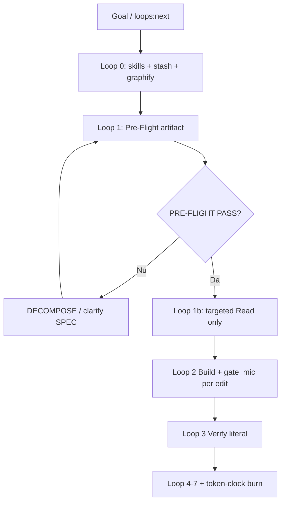

# Superpowers Loops — Pre-Flight în Perfect Loops & AUTOPROMPT (v2.0 Mature)

**Versiune:** 2.0 Mature · **2026-07-09**  
**Bază:** `superpowers.md` · `SOLARIS-LOOPS-MASTER.md` · `AUTOPROMPT.md`  
**Dovadă:** HARD-001/002/004 livrate doar după Pre-Flight + pytest 142 + vitest 1838

---

## §0 — Adult brief

obra/superpowers: verify before done.  
**SOLARIS Loop 1:** verify before **first Read** on product code.

Loop 1 Research **nu** înseamnă „citește cod”. Înseamnă **artifact Pre-Flight complet** — apoi Read **doar** din `BLAST_RADIUS`.

Neonat sare Loop 1. Adult știe că 21 min `npm run verify` la final e autopsie, nu planificare.

---

## §1 — Regula de aur (cu enforcement)

> **Niciun tool Read/Write/StrReplace pe `app/**` sau `survey-engine/**` fără `PRE-FLIGHT: PASS` în checkpoint sau `.autoprompt/state-*.json`.**

| Orchestrator vede | Acțiune |
|---|---|
| Edit produs, zero Pre-Flight | **HALT** — revert, reia Loop 1 |
| Pre-Flight fără GATE_PLAN | **REJECT** — completează §2 din `superpowers.md` |
| BLAST_RADIUS > 15 paths | **WARN** — split task sau amend radius |
| Subagent fără copy Pre-Flight | **REJECT** return |

---

## §2 — Flux obligatoriu (mermaid + gates)



### Gate-uri între loop-uri

| Tranziție | Gate |
|---|---|
| 0 → 1 | `MEMORY_PRIME` + `GRAPH_NODES` ≥ 5 |
| 1 → 2 | `PRE-FLIGHT: PASS` + toate 5 componente |
| 2 → 3 | toate `GATE_PLAN` steps cu exit 0 sau documentat BLOCKED |
| 3 → 7 | `VERIFIED` literal; `OBSERVER: clear` |
| 7 → Ralph [x] | `stash:sync` + `token-clock:burn` |

---

## §3 — Per loop: superpower activ (detaliat)

| Loop | Superpower enforcement | Exemplu SOLARIS |
|---|---|---|
| **0** | Nu începi Pre-Flight fără `memoria` — citește HANDOFF | DNS Shopify = nu promite prod |
| **1** | **Artifact scris** — SPEC, N-BEST, BLAST_RADIUS, PRE-MORTEM, GATE_PLAN | HARD-001: 8 paths, 6 gate steps |
| **2** | Fiecare edit ∈ BLAST_RADIUS; gate_mic imediat | după `twin_runtime.py` → pytest subset |
| **3** | Orchestrator rulează gate, nu crede worker | copiază „142 passed” literal |
| **4** | N-BEST #2 dacă estimate > 250 tokens | Redis stream respins la HARD-001 |
| **5** | Subagent primește **copy** Pre-Flight, nu thread | packet din `find-loops-skills.md` §5 |
| **6** | Feedback = fapte în `grok.md` | „livrat twin-replay”, nu „va fi grozav” |
| **7** | `stash:sync` + burn **doar** verify verde | Grok Code: diff necommitat în LEFT |

---

## §4 — AUTOPROMPT phase lock (v4.5 → v5)

| Fază | Poate atinge cod produs? | Superpower cerut |
|---|---|---|
| PRIME | Nu | memoria + graphify |
| DECOMPOSE | Nu | SPEC per subtask + verify_command |
| PLAN | Nu | N-BEST scorat; GATE_PLAN |
| EXECUTE | **Da** — dacă `pre_flight: pass` | GATE_PLAN live |
| VERIFY | Da (read-only + comenzi) | VERIFIED literal |
| CRITIQUE | Nu (judge) | review 6 lenses |
| HANDOFF | Nu (docs/git) | EVIDENCE + git status |

### State JSON țintă (v5)

```json
{
  "phase": "EXECUTE",
  "pre_flight": "pass",
  "spec": "Done when pytest test_twin_* + vitest twin* pass",
  "blast_radius": ["survey-engine/src/twin_runtime.py", "..."],
  "gate_plan": [{ "step": 1, "file": "...", "gate": "pytest ...", "exit": null }]
}
```

`autoprompt.mjs` refuză `phase: EXECUTE` dacă `pre_flight !== "pass"`.

---

## §5 — Ralph outer loop checklist (copy-paste)

```bash
TASK="$(npm run loops:next 2>&1 | tail -1)"
npm run skills:prime -- "$TASK"
npm run stash:prime -- "$TASK"
npm run graphify:prime -- "$TASK"
npm run graphify:suggest -- "$TASK"

# === LOOP 1: scrie artifact ===
# PRE-FLIGHT: PASS
# SPEC / APPROACH / BLAST_RADIUS / PRE-MORTEM / GATE_PLAN

# === LOOP 2-3: execută GATE_PLAN ===
# după FIECARE edit: gate din tabel

# === LOOP 7 ===
npm run verify:fast   # sau cd app && npm run verify
npm run token-clock:burn -- --task "$TASK" --tokens <N>
npm run stash:sync
# [x] tasks.md
```

---

## §6 — Subagent superpowers packet (minim)

Trimite **doar**:

1. **SPEC** — o propoziție + verify command
2. **GATE_PLAN** — max 8 steps
3. **BLAST_RADIUS** — max 12 paths (din graphify)
4. **PRE-MORTEM** — un paragraf
5. **verify command** — exact string shell

**Nu trimite:** tot thread-ul, `GRAPH_REPORT.md` complet, 50 fișiere context, istoric chat Grok Code.

### Template return așteptat

```
PRE-FLIGHT: PASS (inherited)
DONE: <ce e în diff>
VERIFIED: <comandă + output>
EVIDENCE: <paths citite>
OBSERVER: clear
```

---

## §7 — Exemplu complet: HARD-001 în loops

### Pre-Flight (Loop 1)

```markdown
PRE-FLIGHT: PASS
SPEC: Done when pytest test_twin_* + vitest twin* pass and GET /api/survey/twin-replay proxies.
APPROACH: #1 jsonl seq replay (Verifiability=5)
BLAST_RADIUS:
  - survey-engine/src/twin_runtime.py
  - survey-engine/src/twin_webhook.py
  - survey-engine/src/server.py
  - app/api/lib/surveyTwinReplay.ts
  - app/api/survey/twin-replay/route.ts
  - app/src/hooks/useTwinStream.ts
  - app/server/index.cjs
  - app/api/lib/surveyOpenApi.ts
PRE-MORTEM: Eșuează dacă route lipsește din index.cjs → HTML nu JSON. Detectăm surveyRouteRegistry.test.ts.
GATE_PLAN:
  | 1 | twin_runtime.py replay_twin_events | pytest test_twin_runtime.py::test_replay |
  | 2 | server.py /twin-replay | pytest sau curl :8000/twin-replay |
  | 3 | surveyTwinReplay + route | vitest twinReplayRoute |
  | 4 | useTwinStream catch-up | vitest useTwinStream |
  | 5 | index.cjs tuple | vitest surveyRouteRegistry |
  | 6 | global | npm run verify:fast |
```

### Loop 2 micro-gates

După **fiecare** rând GATE_PLAN — rulezi gate-ul. Nu aștepta step 6 pentru primul pytest.

---

## §8 — Integrare observer + anti-halucinatii

| Semnal | Loop | Superpower răspuns |
|---|---|---|
| S1 edit ∉ BLAST_RADIUS | 2 | amend Pre-Flight sau revert |
| S6 lipsește PRE-FLIGHT | orice | stop → Loop 1 |
| Claim fără VERIFIED | 3 | anti-halucinatii L1 — HALT |
| 3 turns fără gate | 2 | superpowers GATE_PLAN — rulează acum |

---

## §9 — Rubrică neonat vs adult

| | Neonat | Adult |
|---|---|---|
| Loop 1 | „Am înțeles taskul” | artifact §3 din `superpowers.md` |
| N-BEST | o singură idee | 2–3 scorate, Verifiability×2 |
| BLAST_RADIUS | din memorie model | graphify:suggest output |
| GATE_PLAN | verify la final | gate după fiecare edit |
| Subagent | context infinit | packet §6 |

---

## §10 — Respingere orchestrator

```markdown
REJECTED — Superpowers Loops v2.0
Reason: Loop 2 Build started without PRE-FLIGHT: PASS
Evidence: edits in app/ with no SPEC/GATE_PLAN in checkpoint
Required: complete superpowers.md §3 artifact; rerun Loop 1
```

---

**Părinte:** `superpowers.md` · **Skills routing:** `find-loops-skills.md` · **Observer per fază:** `grok-loop-observer.md`