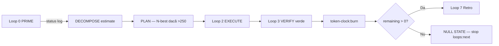

# Token Clock Loop — Economie în Perfect Loops & AUTOPROMPT (v2.0 Mature)

**Versiune:** 2.0 Mature · **2026-07-09**  
**Bază:** `token-clock.md` · `superpowers-loops.md` · `grok-loop-observer.md`  
**State:** `.token-clock/state.json` (gitignored) · **Script:** `scripts/token-clock.mjs`

---

## §0 — Adult brief

`token-clock.md` definește bugetul fictiv 9000 × $280k.  
**Acest fișier** spune **în ce loop** estimezi, **în ce loop** arzi, și **ce se întâmplă** la Null State.

**Regulă de fier:** fără verify exit 0 → **zero burn**.  
**Regulă de fier:** burn înainte de `stash:sync` și `[x]` tasks.md.

Neonat arde tokeni la „am încercat”. Adult arde doar la **DONE verify-verde**.

---

## §1 — Flux în loop (mermaid)



---

## §2 — Per fază / loop (acțiuni concrete)

| Fază / Loop | Acțiune token-clock | Checkpoint |
|---|---|---|
| **0** PRIME | `npm run token-clock:status` | `TOKENS_REMAINING: <N>` |
| **DECOMPOSE** | Sumă `estimate_tokens` per subtask | `TOKEN_ESTIMATE: <sum>` |
| **PLAN** | Dacă estimate > 250 → N-best # mai ieftin | note în PRE-FLIGHT |
| **2** EXECUTE | Observer S7 warn dacă 3 turns fără progres | — |
| **3** VERIFY | **Fără verify verde = fără burn** | VERIFIED literal |
| **CRITIQUE** | Retry → nu burn încă | — |
| **HANDOFF** | Burn parțial doar subtaskuri verify-verde | `TOKENS_BURNED: <n>` |
| **7** Retro | Burn task epic dacă Ralph [x] | remaining actualizat |
| **Ralph batch** | Planifică 9000 / N taskuri epic | la DECOMPOSE batch |

---

## §3 — Estimare calibrată SOLARIS (din `token-clock.md` §2)

| Activitate | Tokens tipici | Loop |
|---|---:|---|
| skills+stash+graphify prime | 8–20 | 0 |
| Pre-Flight scris | 15–30 | 1 |
| Read 5 files targeted | 20–50 | 1 |
| 1 edit + gate_mic | 25–45 | 2 |
| Bridge route (HARD-001 class) | 80–150 | 2–3 |
| Full `npm run verify` | 120–220 | 3 |
| Retry același eșec | +40–80 | 3–4 |
| Epic greșit reluat | 200–500 | **prevent Loop 1** |

### Formula DECOMPOSE

```
estimate = prime(15) + preflight(25) + (edits × 35) + (gates × 15) + (verify_full ? 150 : 40)
```

Dacă `estimate > 250` → superpowers N-best #2 sau split subtask (observer S7 WARN).

---

## §4 — Orchestrator rules (batch & subagent)

1. **Batch 10 HARD tasks** → buget planificat ≈ 9000/10 = **900 tokens/epic** (DECOMPOSE)
2. **Subagent** primește `TOKEN_BUDGET: N` în brief (`find-loops-skills.md` §5)
3. **Depășire budget** fără verify → observer **halt**, nu burn
4. **NULL STATE** (`remaining = 0`) → stop `loops:next`, raport uman — nu „un ultim task”
5. **Partial epic** — burn doar subtaskuri cu gate verde; restul rămân estimate

### Exemplu batch HARD-001..004

| Task | Estimate | Actual burn (după verify) |
|---|---:|---:|
| HARD-001 twin | 120 | 95 |
| HARD-002 budget | 90 | 72 |
| HARD-004 router | 110 | 88 |
| **Batch partial** | 320 | 255 |

---

## §5 — AUTOPROMPT state (v5 țintă)

```json
{
  "token_estimate": 120,
  "token_burned": 0,
  "burn_after_verify": true,
  "subtasks": [
    { "id": "T1", "estimate": 40, "burned": 0, "verified": false },
    { "id": "T2", "estimate": 80, "burned": 0, "verified": false }
  ]
}
```

Runner refuză `phase: HANDOFF` cu `token_burned` incrementat dacă `verify_output` lipsește.

---

## §6 — Comenzi loop tipice (runbook)

```bash
# Start sesiune / Ralph
npm run token-clock:status

# După loops:next
npm run skills:prime -- "HARD-004 router stats"
# ... Loop 1-3 ...

# Verify verde
cd survey-engine && python -m pytest tests/test_router.py -q
cd app && npm run test -- src/__tests__/surveyRouteRegistry.test.ts

# Burn (DOAR acum)
npm run token-clock:burn -- --task "HARD-004-router-stats" --tokens 88

# Retro
npm run stash:sync
npm run token-clock:status   # log remaining în checkpoint final
```

---

## §7 — Legătura cu superpowers & observer

| Situație | Token impact | Răspuns |
|---|---|---|
| Pre-Flight GATE_PLAN prea lung | waste | observer warn → compress plan |
| Verifiability mică în N-BEST | rework 200–500 | alege abordarea cu gate mic |
| 3× retry verify | +120–240 | halt S3, schimbă abordare |
| Skip Loop 1 Pre-Flight | epic greșit | **prevent** — superpowers S6 halt |

**Superpowers economisește tokeni** prin Verifiability — nu e invers: token-clock nu înlocuiește Pre-Flight.

---

## §8 — Null State protocol

Când `remaining = 0`:

1. Stop `loops:next` și AUTOPROMPT batch
2. Checkpoint:

```
NULL_STATE: true
TOKENS_REMAINING: 0
LEFT: <taskuri nefinisate>
ACTION: human token-clock:init --confirm sau retrospective
```

3. **Nu** marca `[x]` pe taskuri fără verify doar ca să „închidă” bugetul

---

## §9 — Checkpoint extension

```
TOKENS_REMAINING: 8742
TOKEN_ESTIMATE: 95
TOKENS_BURNED: 95
TOKEN_TASK: HARD-001-twin-replay-complete
```

Orchestrator batch adaugă:

```
TOKEN_BATCH_PLAN: 4 tasks × ~200 = 800 estimated
TOKEN_BATCH_BURNED: 255
```

---

## §10 — Rubrică neonat vs adult

| | Neonat | Adult |
|---|---|---|
| Burn | la „feel done” | după verify exit 0 |
| Estimate | absent | DECOMPOSE cu formulă |
| Retry | burn de fiecare dată | burn doar la succes |
| Null State | ignorat | stop loops |
| Subagent | fără budget | TOKEN_BUDGET în brief |

---

## §11 — Incidente → token discipline

| Incident | Pierdere tokens | Fix loop |
|---|---|---|
| Grok Code crash, zero commit | 500+ | Loop 0 recovery + Pre-Flight |
| 3× full verify fără fix | 360–660 | observer S3 halt |
| Drive-by refactor 30 files | 300+ | S4 scope split |
| AUTOPROMPT stub done | burn fictiv | nu burn; HALUCINATION_RISK high |

---

**Părinte:** `token-clock.md` · **Pre-Flight:** `superpowers-loops.md` · **Observer:** `grok-loop-observer.md`