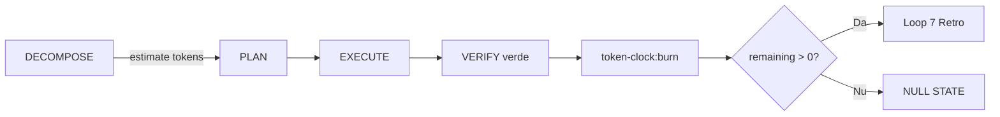

# Token Clock Loop — Integrare în Loops & AUTOPROMPT

**Bază:** `token-clock.md` · `superpowers-loops.md` · `grok-loop-observer.md`

---

## Unde intră ceasul în loop



---

## Per fază

| Fază | Acțiune token-clock |
|---|---|
| PRIME | `status` — log remaining în checkpoint |
| DECOMPOSE | Sumă `estimate_tokens` per subtask |
| PLAN | Dacă estimate > 200 → N-best # mai ieftin |
| EXECUTE | Observer warn dacă 3 turns fără progres |
| VERIFY | **Fără verify verde = fără burn** |
| CRITIQUE | Dacă retry → nu burn încă |
| HANDOFF | Burn parțial doar subtaske verify-verde |
| Ralph [x] | Burn pentru task epic |

---

## Orchestrator rules

1. **Batch 10 taskuri** → buget 9000 / 10 ≈ 900 tokeni epic (planificare)
2. **Subagent** primește `TOKEN_BUDGET: N` în brief
3. **Depășire budget** → halt observer, nu burn
4. **NULL STATE** → stop `loops:next`, raportează uman

---

## AUTOPROMPT state (v5 țintă)

```json
{
  "token_estimate": 120,
  "token_burned": 0,
  "burn_after_verify": true
}
```

---

## Comenzi loop tipice

```bash
npm run token-clock:status
npm run loops:next
# ... task ...
npm run verify:fast
npm run token-clock:burn -- --task "T2-router-stats" --tokens 65
npm run stash:sync
```

---

## Legătura cu superpowers

Pre-Flight GATE_PLAN prea lung → observer warn → **token waste**  
Superpowers refuză planuri cu Verifiability mică tocmai ca să **economisească tokeni** din ceas.